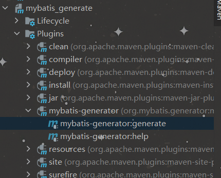
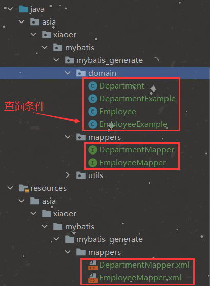
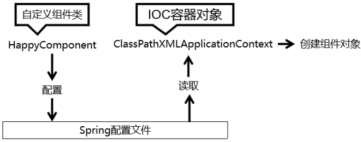
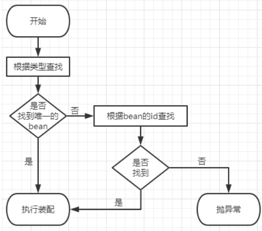
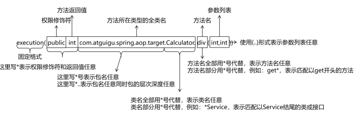
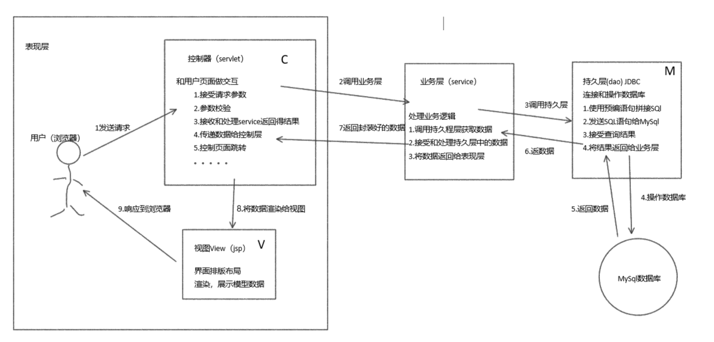
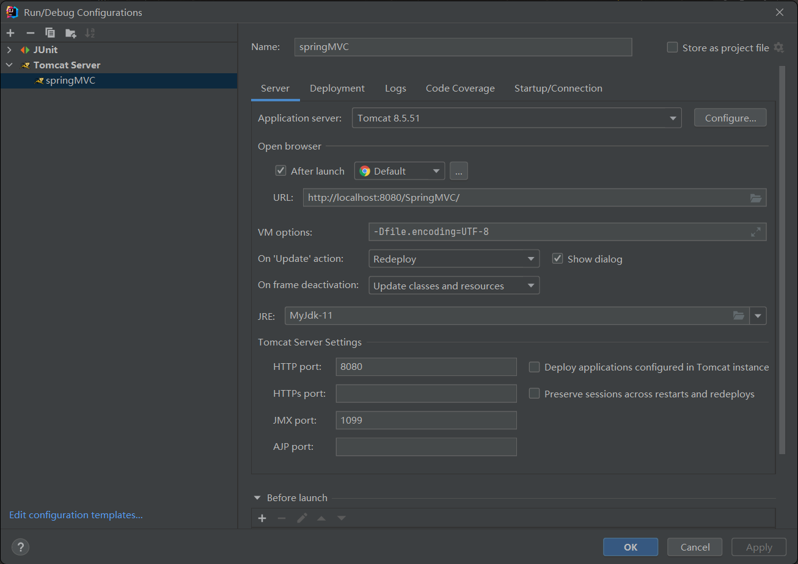
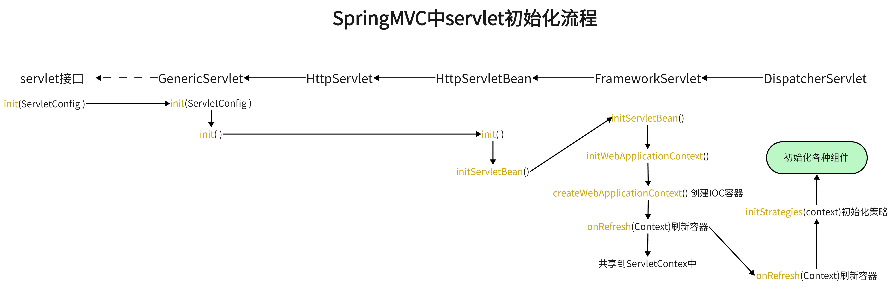
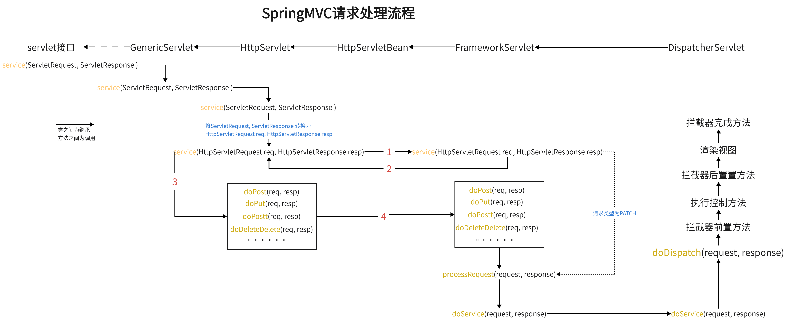
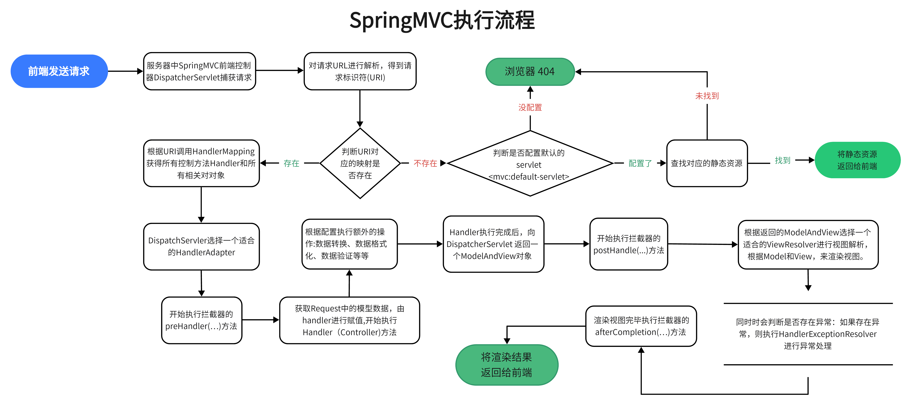

# MyBatis详记 
## 前言

​    MyBatis 是一款优秀的持久层框架，它支持定制化 SQL、存储过程以及高级映射。MyBatis 避免了几乎所有的 JDBC 代码和手动设置参数以及获取结果集。MyBatis 可以使用简单的 XML 或注解来配置和映射原生信息，将接口和 Java 的 POJOs(Plain Ordinary Java Object,普通的 Java对象)映射成数据库中的记录

<br>

## Mybatis简述

1. Mybatis特性
   - MyBatis 是支持定制化 SQL、存储过程以及高级映射的优秀的持久层框架
   - MyBatis 避免了几乎所有的 JDBC 代码和手动设置参数以及获取结果集 
   - MyBatis可以使用简单的XML或注解用于配置和原始映射，将接口和Java的POJO（Plain Old Java Objects，普通的Java对象）映射成数据库中的记录
   - MyBatis 是一个 半自动的ORM（Object Relation Mapping）框架
2. 和JDBC对比
   * JDBC
     * SQL夹杂在Java代码中耦合度高
     * 维护不易且实际开发需求中SQL有变化，频繁修改的情况多见
     * 代码冗长，开发效率低
   * MyBatis
     * 轻量级，性能出色
     * SQL和Java编码分开，功能边界清晰（Java专注于业务、Sql语句专注数据）
     * 本质上是对JDBC的封装

<br>

## Mybatis的简单使用

> [项目演示代码](https://github.com/Xiao2Te6/SSM/tree/main/mybatiss_demo)

1. 创建maven项目和对应数据库，并导入依赖

   ```xml
   <!-- mybatis -->
           <dependency>
               <groupId>org.mybatis</groupId>
               <artifactId>mybatis</artifactId>
               <version>3.5.6</version>
           </dependency>
   
           <!--MySql 数据库链接驱动 -->
           <dependency>
               <groupId>mysql</groupId>
               <artifactId>mysql-connector-java</artifactId>
               <version>8.0.22</version>
               <scope>runtime</scope>
           </dependency>
   
           <!--单元测试工具-->
           <dependency>
               <groupId>junit</groupId>
               <artifactId>junit</artifactId>
               <version>4.12</version>
               <scope>test</scope><!-- 测试阶段才用 -->
           </dependency>
   
           <!--JavaBean 注解工具-->
           <dependency>
               <groupId>org.projectlombok</groupId>
               <artifactId>lombok</artifactId>
               <version>1.18.12</version>
           </dependency>
   
           <!-- log4j日志 -->
           <dependency>
               <groupId>log4j</groupId>
               <artifactId>log4j</artifactId>
               <version>1.2.17</version>
           </dependency>
   
   ```

   

2. 创建MyBatis的核心配置文件mybatis-config.xml，用于配置连接数据库的环境以及MyBatis的全局配置信息和创建log4g配置文件log4j.xml

   mybatis-config.xml ：

   ```xml
   <?xml version="1.0" encoding="UTF-8" ?>
   <!DOCTYPE configuration
           PUBLIC "-//mybatis.org//DTD Config 3.0//EN"
           "http://mybatis.org/dtd/mybatis-3-config.dtd">
   
   
   <!--mybatis的主配置 -->
   <configuration>
   
       <!--在MyBatis的配置文件中各个部分需要按照如下顺序配置： properties?,settings?,typeAliases?,typeHandlers?,objectFactory?,objectWrapperFactory?,reflectorFactory?,plugins?,environments?,databaseIdProvider?,mappers?-->
       
       <!-- 加载数据库连接配置文件 后续可以使用 ${key} 形式获取value -->
       <properties resource="db.properties"/>
   
       <!-- 类型别名 ：
               package：该包下所有类的全类名默认别名为类名且不区分大小写
               typeAlias: type = "需要取别名的类型" alias = "别名（不设置alias属性使用默认别名）"
        -->
       <typeAliases>
           <package name="com.atxiao2.mybatis_maven_test.domain"/>
       </typeAliases>
   
       <!--environments： 对于mybatis连接到的环境进行配置
            本地环境 localhost
            测试环境 test
            现网运行环境 master
       -->
       <environments default="localhost">
           <environment id="localhost">
               <!-- JDBC: 对应mybatis包中的org.apache.ibatis.transaction.jdbc.JdbcTransactionFactory类，JDBC中的内置事务管理器
                     MANAGED: 被框架管理（如spring）  -->
               <transactionManager type="JDBC"/>
               <dataSource type="POOLED"> <!--POOLED:使用连接池 UNPOOLED:不使用连接池 JNDI:使用上下文中的数据源-->
                   <property name="driver" value="${driverClassName}"/>
                   <property name="url" value="${url}"/>
                   <property name="username" value="${username}"/>
                   <property name="password" value="${password}"/>
               </dataSource>
           </environment>
       </environments>
   
       <!--引入映射文件：mapper接口和映射文件需要所在的包必须一致(编译过后在同一包下)且名字也得一致-->
       <mappers>
           <mapper resource="asia/xiaoer/mybatis/mybatis_demo/mappers"/>
       </mappers>
   
   </configuration>
   ```

   log4j.xml：

   ```xml
   <?xml version="1.0" encoding="UTF-8" ?>
   <!DOCTYPE log4j:configuration SYSTEM "log4j.dtd">
   <log4j:configuration xmlns:log4j="http://jakarta.apache.org/log4j/">
       <appender name="STDOUT" class="org.apache.log4j.ConsoleAppender">
           <param name="Encoding" value="UTF-8" />
           <layout class="org.apache.log4j.PatternLayout">
               <param name="ConversionPattern" value="%-5p %d{MM-dd HH:mm:ss,SSS}%m (%F:%L) \n" />
           </layout>
       </appender>
       <logger name="java.sql">
           <level value="debug" />
       </logger>
       <logger name="org.apache.ibatis">
           <level value="info" />
       </logger>
       <root>
           <level value="debug" />
           <appender-ref ref="STDOUT" />
       </root>
   </log4j:configuration>
   ```

3. 创建Mapper接口，MyBatis中的mapper接口相当于以前的DAO层。但是区别在于，mapper仅仅是接口，不需要提供实现类（实现类由maibatis底层的动态代理实现）

4. 创建MyBatis的映射文件（**ORM（Object Relationship Mapping）对象关系映射**）MyBatis映射文件用于编写SQL，访问以及操作表中的数据

   | JavaObject | 数据库Object        |
   | ---------- | ------------------- |
   | 类         | 表                  |
   | 属性       | 字段/列             |
   | 对象       | 数据库中一行记录/行 |

   * 表所对应的 实体类 的类名+Mapper.xml （和对应接口名一致）
   * MyBatis映射文件存放的位置是resources下路径应和对应Mapper接口相对应（一致）
   * **映射文件的namespace**（命名空间）应和**mapper接口的全类名**（全限定名）保持一致
   * **映射文件中编写SQL的标签的id属性**应**和mapper接口中方法的方法名**保持一致

   ```xml
   <?xml version="1.0" encoding="UTF-8" ?>
   <!DOCTYPE mapper
           PUBLIC "-//mybatis.org//DTD Mapper 3.0//EN"
           "http://mybatis.org/dtd/mybatis-3-mapper.dtd">
   <mapper namespace="asia.xiaoer.mybatis.mybatis_demo.mappers.UserMapper">
   
       <!--int insertUser();-->
       <insert id="insertUser">
           insert into user values(null,'李四',19,'男');
       </insert>
    
   </mapper>
   ```

5. 创建测试类测试

   ```java
   //读取MyBatis的核心配置文件
   InputStream is = Resources.getResourceAsStream("mybatis-config.xml");
   
   //创建SqlSessionFactoryBuilder对象
   SqlSessionFactoryBuilder sqlSessionFactoryBuilder = new SqlSessionFactoryBuilder();
   //通过核心配置文件所对应的字节输入流创建工厂类SqlSessionFactory，生产SqlSession对象
   SqlSessionFactory sqlSessionFactory = sqlSessionFactoryBuilder.build(is);
   
   //创建SqlSession对象,传入参数true通过SqlSession对象所操作的sql都会自动提交
   SqlSession sqlSession = sqlSessionFactory.openSession(true);
   
   //通过代理模式创建UserMapper接口的代理实现类对象(mybatis底层的动态代理)
   UserMapper userMapper = sqlSession.getMapper(UserMapper.class);
   
   //调用UserMapper接口中的方法，就可以根据UserMapper的全类名匹配元素文件，通过调用的方法名匹配映射文件中的SQL标签，并执行标签中的SQL语句
   int result = userMapper.insertUser();
   // sqlSession.commit();//提交事务
   System.out.println("结果："+result);
   
   //释放资源
   sqlSession.close();
   is.close();
   ```

> 建议将mybatis-comfig.xml 和 Mapper.xml 在IDEA中添加对应的模板（File | Settings | Editor | File and Code Templates），方便快速创建 

<br>

## Mybatis获取参数值的两种方式

> 前面都是在mapper中写入的固定值，这种方式在大部分开发中都不常用，更多时候需要拿到传入的参数写到sql中去。

1. MyBatis获取参数值的两种方式：使用**${}**方式和使用**#{}**方式 	

   * **#{}**的本质就是占位符赋值 ，赋值时会自动为参数添加单引号； 

   * **${}**本质上使用字符串拼接的方式拼接sql，若为字符串类型或日期类型的字段进行赋值时，**需要手动加单引号**；

2. MyBatis获取参数值时针对各种参数的获取方式

   * **单个字面量类型的参数**：若mapper接口中的方法参数为单个的字面量类型 此时可以使用${}和#{}以任意的名称获取参数的值。

   * **多个字面量类型的参数**：若mapper接口的方法参数为多个时

     * MyBatis会自动将参数放在一个map集合中，以arg0,arg1...为键，以参数为值；或以 param1,param2...为键，以参数为值，
     * 或者手动创建map集合，
     * 或者**通过@Param注解标识mapper接口中的方法参数**，自定义放在集合中的元素的key值，以@Param注解的value属性值为键，以参数为值，

     此时只需要通过${}和#{}访问map集合的键就可以获取相对应的值。

     * **实体类类型的参数**：若mapper接口中的方法参数为实体类对象时 此时可以使用${}和#{}，通过访问实体类对象中的属性名获取属性值（**mybatis会通过getter()和setter()方法去获取对应属性，只要有getter()或setter()就能拿到，不管有没有对应字段**）

<br>

## Mybatis的增删改查和部分特殊sql执行

> 这里以Department实体对象为例，内中有id，name, sn三个字段

* **增删改查**

  * 增

    DepartmentMapper接口：

    ```java
    void insert(Department dept);
    ```

    DepartmentMapper.xml:

    ```xml
    <insert id="insert">
        insert into department values (#{id}, #{name}, #{sn});
    </insert>
    ```

  * 删

    DepartmentMapper接口：

    ```java
    void delete(Long id);
    ```

    DepartmentMapper.xml:

    ```xml
    <delete id="delete">
    	delete from department where id = #{id};
    </delete>
    ```

  * 改

    DepartmentMapper接口：

    ```java
    void update(Department dept);
    ```

    DepartmentMapper.xml:

    ```xml
    <update id="update">
    	update department set name = #{name}, sn = #{sn} where id = #{id};
    </update>
    ```

  * 查一个实体对象

    DepartmentMapper接口：

    ```java
    Department selectOne(Long id);
    ```

    DepartmentMapper.xml:

    ```xml
    <select id="selectOne" resultType="Department">
    	select * from department where id = #{id};
    </select>
    ```

  * 查所有实体对象，并装在一个List集合中

    DepartmentMapper接口：

    ```java
    List<Department> selectAll();
    ```

    DepartmentMapper.xml:

    ```xml
    <select id="selectAll" resultType="Department">
    	select * from department;
    </select>
    ```

  * 查询单个数据

    DepartmentMapper接口：

    ```java
    int getDeptCount();
    ```

    DepartmentMapper.xml:

    ```xml
    <select id="getDeptCount" resultType="java.lang.Integer">
    	select count(*) from department
    </select>
    ```

  * 查询一条数据为map集合

    DepartmentMapper接口：

    ```java
    List<Map<String, Object>> getDeptToMap(Long id);
    ```

    DepartmentMapper.xml:

    ```xml
    <select id="getDeptToMap" resultType="java.util.Map">
    	select * from department where id = #{id};
    </select>
    ```

  * 查询所有数据为Map集合 (使用@MapKey注解将id作为多条Map结果的键存在大的Map中)

    DepartmentMapper接口：

    ```java
    @MapKey("id")
    Map<String, Object> getAllToMap();
    ```

    DepartmentMapper.xml:

    ```xml
    <select id="getDeptToMap" resultType="java.util.Map">
    	select * from department;
    </select>
    ```

* **部分特殊sql执行**

  * 模糊查询

    DepartmentMapper接口：

    ```java
    List<Department> fuzzySearch(String keyWord);
    ```

    DepartmentMapper.xml:

    ```xml
    <select id="fuzzySearch" resultType="Department">
        select * from department
        where name like '%${keyWord}%' or id like '%${keyWord}%' or sn like '%${keyWord}%'
    </select>
    
    ```

  * 批量删除

    DepartmentMapper接口：

    ```java
    void  batchDeletion(String ids);
    ```

    DepartmentMapper.xml:

    ```xml
    <delete id="batchDeletion">
        delete from department where id in (${ids})
    </delete>
    ```

  * 动态设置表名，根据表名查询表中所有数据

    DepartmentMapper接口：

    ```java
    List<Department> selectAllForTableName(String tableName);
    ```

    DepartmentMapper.xml:

    ```xml
    <select id="selectAllForTableName" resultType="Department">
        select * from ${tableName}
    </select>
    ```

  * 添加时动态获取自增主键

    DepartmentMapper接口：

    ```java
    int insertOne(Department dept);
    ```

    DepartmentMapper.xml:

    ```xml
    <!--useGeneratedKeys：设置使用自增的主键 keyProperty：将自增的主键放在传输的参数user对象的某个属性中-->
    <insert id="insertOne" useGeneratedKeys="true" keyProperty="id">
        insert into department values (null, #{name}, #{sn});
    </insert>
    ```

<br>

## 自定义映射resultMap的使用

>resultMap标签的使用：
>
>​		resultMap：设置自定义映射
>​		属性：
>​			id：表示自定义映射的唯一标识
>​			type：查询的数据要映射的实体类的类型
>​		子标签：
>​			id：设置主键的映射关系
>​			result：设置普通字段的映射关系
>​			association：设置多对一的映射关系
>​				属性：
>​					javaType：设置属性类型
>​					select：设置分步查询，查询某个属性的值的sql的标识（namespace.sqlId）
>​        			column：将sql以及查询结果中的某个字段设置为分步查询的条件(传给第二步中的参数)
>​			collection：设置一对多的映射关系
>
>​				属性：
>​					ofType：设置集合中所存储的类型
>​					select：设置分步查询，查询某个属性的值的sql的标识（namespace.sqlId）
>​      		  	column：将sql以及查询结果中的某个字段设置为分步查询的条件		
>​		属性：
>​			property：设置映射关系中实体类中的属性名
>​			column：设置映射关系中表中的字段名

1. **resultMap处理字段和属性的映射关系**

   > 当字段名和实体类中的属性名不一致时，则可以通过resultMap设置自定义映射

    EmployeeMapper接口:

   ```java
   Employee selectOne(Long id);
   ```

   EmployeeMapper.xml:

   ```xml
   <resultMap id="employeeMap" type="Employee">
       <id property="id" column="id"/>
       <result property="name" column="name"/>
       <result property="password" column="password"/>
       <result property="email" column="email"/>
       <result property="age" column="age"/>
       <result property="deptId" column="dept_id"/>
   </resultMap>
   
   <select id="selectOne" resultMap="employeeMap">
       select * from employee where id = #{id};
   </select>
   ```

   > 也可以使用在mybatis-config.xml中加入全局配置，将数据库中xxx_yy形式的数据自动匹配java中的驼峰命名形式xxxYy
   >
   > ```xml
   > <settings>
   >  <setting name="mapUnderscoreToCamelCase" value="true"/>
   > </settings>
   > ```

2. **多对一映射处理**（多个员工对应一个部门）

   * 级联方式处理映射关系

     EmployeeMapper接口:

     ```java
     Employee selectOne(Long id);
     ```

     EmployeeMapper.xml:

     ```xml
     <resultMap id="employeeMap" type="Employee">
         <id property="id" column="id"/>
         <result property="name" column="name"/>
         <result property="password" column="password"/>
         <result property="email" column="email"/>
         <result property="age" column="age"/>
         <result property="dept.id" column="d_id"/>
         <result property="dept.name" column="d_name"/>
         <result property="dept.sn" column="d_sn"/>
     </resultMap>
     
     <select id="selectOne" resultMap="employeeMap">
         select e.id, e.name, e.password, e.email, e.age, d.id d_id, d.name d_name, d.sn d_sn
         from employee e join department d on e.dept_id = d.id
         where e.id = #{id}
     </select>
     ```

   * 使用association处理映射关系（**处理实体类型属性** （**javaType**））

     EmployeeMapper接口:

     ```java
     Employee selectOne(Long id);
     ```

     EmployeeMapper.xml:

     ```xml
     <resultMap id="employeeMap" type="asia.xiaoer.mybatis.mybatis_resultmap.domain.Employee">
         <id property="id" column="id"/>
         <result property="name" column="name"/>
         <result property="password" column="password"/>
         <result property="email" column="email"/>
         <result property="age" column="age"/>
         <association property="dept" javaType="Department">
             <result property="dept.id" column="d_id"/>
             <result property="dept.name" column="d_name"/>
             <result property="dept.sn" column="d_sn"/>
         </association>
     </resultMap>
     
     <select id="selectOne" resultMap="employeeMap">
         select e.id, e.name, e.password, e.email, e.age, d.id d_id, d.name d_name, d.sn d_sn
         from employee e join department d on e.dept_id = d.id
         where e.id = #{id}
     </select>
     ```

   * 使用association分步查询

     * 分布查询第一步

       EmployeeMapper接口:

       ```java
       //使用association分布查询员工和员工所在部门 第一步
       Employee selectOneForSubStep(Long id);
       ```

       EmployeeMapper.xml:

       ```xml
       <!--使用association分步查询-->
       <resultMap id="employeeMap" type="asia.xiaoer.mybatis.mybatis_resultmap.domain.Employee">
           <id property="id" column="id"/>
           <result property="name" column="name"/>
           <result property="password" column="password"/>
           <result property="email" column="email"/>
           <result property="age" column="age"/>
           <!--select：设置分步查询，查询某个属性的值的sql的标识（namespace.sqlId）
               column：将sql以及查询结果中的某个字段设置为分步查询的条件-->
           <association property="dept" select="asia.xiaoer.mybatis.mybatis_resultmap.mappers.DepartmentMapper.selectOne" column="id"/>
       </resultMap>
       ```

     * 分布查询第二步

       DepartmentMapper接口:

       ```java
       //使用association分布查询员工和员工所在部门 第二步
       Department selectOne(Long id);
       ```

       DepartmentMapper.xml:

       ```xml
       <select id="selectOne" resultType="Department">
           select * from department where id = #{id};
       </select>
       ```

       > 分步查询的优点：可以实现延迟加载(查找内容需要时再加载第二步)
       >
       > * 但是必须在核心配置文件中设置全局配置信息：
       >
       >   1. azyLoadingEnabled：延迟加载的全局开关。当开启时，所有关联对象都会延迟加载 
       >
       >   2. aggressiveLazyLoading：当开启时，任何方法的调用都会加载该对象的所有属性。 否则，每个 属性会按需加载 此时就可以实现按需加载，获取的数据是什么，就只会执行相应的sql（默认为false （在 3.4.1 及之前的版本中默认为 true））
       >
       >      ```xml
       >      <settings>
       >          <!--开启懒加载-->
       >          <setting name="lazyLoadingEnabled" value="true"/>
       >          <setting name="aggressiveLazyLoading" value="false"/>
       >      </settings>
       >      ```
       >
       >   3. 完成全局配置后可通过association和 collection中的fetchType属性设置当前的分步查询是否使用延迟加载，fetchType="lazy(延迟加 载)/eager(立即加载)"

3. **一对多映射处理**（一个部门对应多个员工）

   * 使用collection处理映射关系（**处理集合类型属性 **（**ofType**））

     DepartmentMapper接口:

     ```java
     //使用collection查询部门和部门中的所有员工
     Department selectDepartmentAndEmployee(Long id);
     ```

     DepartmentMapper.xml:

     ```xml
     <resultMap id="departmentMap" type="Department">
         <id column="id" property="id"/>
         <result column="name" property="name"/>
         <result column="sn" property="sn"/>
         <collection property="employees" ofType="Employee">
             <result column="e_id" property="id"/>
             <result column="e_name" property="name"/>
             <result column="e_password" property="password"/>
             <result column="e_email" property="email"/>
             <result column="e_age" property="age"/>
             </collection>
     </resultMap>
     
     <select id="selectDepartmentAndEmployee" resultMap="departmentMap">
         select d.id, d.name, d.sn, e.id e_id ,e.name e_name, e.password e_password, e.email e_email, e.age e_age
         from department d left join employee e on d.id = e.dept_id
         where d.id = #{id}
     </select>
     ```

   * 分步查询

     *  分布查询第二部

        DepartmentMapper接口:

        ```java
        //使用collection分步查询部门和部门中的所有员工 第一步
        Department selectOneForSubStep(Long id);
        ```

        DepartmentMapper.xml:

        ```xml
        <resultMap id="departmentSubStepMap" type="asia.xiaoer.mybatis.mybatis_resultmap.domain.Department">
            <id column="id" property="id"/>
            <result column="name" property="name"/>
            <result column="sn" property="sn"/>
            <collection property="employees" select="asia.xiaoer.mybatis.mybatis_resultmap.mappers.EmployeeMapper.selectEmployeeForSubStep" column="id"/>
        </resultMap>
        
        <!--//使用collection分步查询部门和部门中的所有员工 第一步-->
        <select id="selectOneForSubStep" resultMap="departmentSubStepMap">
            select * from department where id = #{id};
        </select>
        
        ```

     *  分布查询第一步

        EmployeeMapper接口:

        ```java
        //使用collection分步查询部门和部门中的所有员工 第二步
        List<Employee> selectEmployeeForSubStep(Long deptId);
        ```

        EmployeeMapper.xml:

        ```xml
        <!--使用collection分步查询部门和部门中的所有员工 第二步-->
        <select id="selectEmployeeForSubStep" resultType="Employee">
            select * from employee where dept_id = #{deptId};
        </select>
        ```

<br>

## Mybatis动态拼装SQL

1. **if标签**

   > if标签可通过test属性的表达式进行判断，若表达式的结果为true，则会将标签中的内容拼接到sql中；反之则忽略标签中的sql

   * DepatmentMapper接口：

     ```java
     //根据传入条件查询符合的部门
     List<Department> selectForConditions(Department dept);
     ```

   * DepatmentMapper.xml：

     ```xml
     <!--if 标签使用演示 查询符合条件的部门-->
     <select id="selectForConditions" resultType="Department">
         select * from department where
         <if test="id != null and id != ''">
             id = #{id}
         </if>
         <if test="name != null and name != ''">
             and name = #{name}
         </if>
         <if test="sn != null and sn != ''">
             and sn = #{sn}
         </if>
     ```

     > 缺陷：
     >
     > 1. 当第一条if不满足时，会直接拼接第二条语句导致多一个 and 关键字从而导致sql错误
     > 2. 当所有条件都不满足时 sql语句会以 where结尾 导致sql错误
     >
     > 解决方法：
     >
     > 1. 解决方法一：在 where后面添加 1=1 恒等条件，并在每条if标签中的语句前加上and关键字
     > 2. 缺陷1可以使用 trim标签避免 ，缺陷2可以使用where标签避免

2. **where标签 和 set标签**

   > * where标签 ：wehre和if一般结合使用，若 where标签中的if条件都不满足，则where标签没有任何功能不会添加where关键字 ,若where标签中的if条件满足，则where标签会自动添加where关键字，并将if标签中sql语句最前方多余的 and去掉 (注意：where标签不能去掉条件最后多余的and)
   >
   > * set标签：set标签和where类似，可以标签中if标签判断结果动态添加set关键字，并去除if标签内容末尾的逗号

   * DepatmentMapper接口：

     ```java
     //根据传入条件查询符合的部门
     List<Department> selectForConditions(Department dept);
     ```

   * DepatmentMapper.xml：

     ```xml
     <!--使用where优化，根据传入条件查询符合的部门-->
     <select id="selectForConditions" resultType="Department">
         select * from department
             <where>
                 <if test="id != null and id != ''">
                     and id = #{id}
                 </if>
                 <if test="name != null and name != ''">
                     and name = #{name}
                 </if>
                 <if test="sn != null and sn != ''">
                     and sn = #{sn}
                 </if>
             </where>
     </select
     ```

3. trim标签

   > trim用于去掉或添加标签中的内容
   >
   > *  常用属性： 
   >    * prefix：在trim标签中的内容的前面动态添加某些内容
   >    * prefixOverrides：在trim标签中的内容的前面动态去掉某些内容 
   >    * suffix：在trim标签中的内容的后面动态添加某些内容 
   >    * suffixOverrides：在trim标签中的内容的后面动态去掉某些内容

   - DepatmentMapper接口：

     ```java
     //根据传入条件查询符合的部门
     List<Department> selectForConditions(Department dept);
     ```

   - DepatmentMapper.xml：

     ```xml
     <!--使用trim优化，根据传入条件查询符合的部门-->
     <select id="selectForConditions" resultType="Department">
         select * from department
         <trim prefix="where"  prefixOverrides="and">
             <if test="id != null and id != ''">
                 and id = #{id}
             </if>
             <if test="name != null and name != ''">
                 and name = #{name}
             </if>
             <if test="sn != null and sn != ''">
                 and sn = #{sn}
             </if>
         </trim>
     </select>
     ```

4. choose标签、when标签、otherwise标签（相当于if...else if...else）

   - DepatmentMapper接口：

     ```java
     //根据传入条件查询符合的部门
     List<Department> selectForConditions(Department dept);
     ```

   - DepatmentMapper.xml：

     ```xml
     <!-- 演示choose标签、when标签、otherwise标签
          根据传入的多个条件查询符合 其一 的部门  -->
     <select id="selectForConditions" resultType="Department">
         select * from department
         <where>
             <choose>
                 <when test="id != null and id != ''">
                     id = #{id};
                 </when>
                 <when test="name != null and name != ''">
                     name = #{name};
                 </when>
                 <when test="sn != null and sn != ''">
                     sn = #{sn};
                 </when>
                 <!--当所有条件不符合时查询id为1的部门-->
                 <otherwise>
                     id = 1;
                 </otherwise>
             </choose>
         </where>
     </select>
     ```

5. **foreach标签**

   > froeach标签会循环拼接标签中的内容
   >
   > *  常用属性： 
   >    * collection：设置要循环的数组或集合 
   >    * item：表示遍历出的集合或数组中的每一个数据 
   >    * separator：设置循环体之间的分隔符 
   >    * open：设置foreach标签中循环体开始的内容（符号）
   >    * close：设置foreach标签中循环体开始的内容（符号）

   - 使用foreach标签进行部门的批量添加

     - DepatmentMapper接口：

       ```java
       //使用foreach标签进行批量添加
       void batchAdd(@Param(value = "departments")List<Department> departments);
       ```

     - DepatmentMapper.xml：

       ```xml
       <!--使用foreach标签进行批量添加-->
       <insert id="batchAdd" keyProperty="id" useGeneratedKeys="true">
           insert into department values
           <foreach collection="departments" item="dept" separator=",">
               (null, #{dept.name}, #{dept.sn})
           </foreach>
       </insert>
       ```

       > Mybaitis会自动将lis类型参数放在一个map集合中，以list为键 传入参数为值，为方便取值这里使用了@Param注解自定义map的键

   - 使用foreach标签进行部门的批量删除

     - DepatmentMapper接口：

       ```java
       //使用foreach标签进行批量删除
       void batchDeleteForId(@Param(value = "ids")int[] ids);
       ```

     - DepatmentMapper.xml：

       ```xml
       <!--使用foreach标签进行批量删除-->
       <delete id="batchDeleteForId">
           delete from department where id in
           <foreach collection="ids" item="id" separator="," open="(" close=")">
               #{id}
           </foreach>
       </delete>
       ```

       > Mybaitis会自动将数组类型参数放在一个map集合中，以array为键 传入参数为值，为方便取值这里使用了@Param注解自定义map的键

6. sql标签

   > sql标签，可以记录一段公共sql片段，在使用的地方通过include标签进行引入

   - DepatmentMapper接口：

     ```java
     //使用Sql标签演示
     Department selectOne(Long id);
     ```

   - DepatmentMapper.xml：

     ```xml
     <!--Sql片段演示-->
     <sql id="deptColumn" >
        id, name, sn
     </sql>
     
     <select id="selectOne" resultType="Department">
         select <include refid="deptColumn"/> from department d where id = #{id};
     </select>
     ```

<br>

## MyBatis的缓存

1. MyBatis的一级缓存

   > 一级缓存是SqlSession级别的，通过同一个SqlSession查询的数据会被缓存，下次查询相同的数据，就会从缓存中直接获取，不会从数据库重新访问
   >
   > * 使一级缓存失效的四种情况：
   >   * 两次查询不是同一个SqlSession
   >   * 同一个SqlSession但两次查询内容不相同
   >   * 同一个SqlSession两次查询期间执行了**任何一次增删改**操作
   >   * 同一个SqlSession两次查询期间手动清空了缓存

2. **MyBatis的二级缓存**

   > 二级缓存是SqlSessionFactory级别，通过同一个SqlSessionFactory创建的SqlSession查询的结果会被 缓存；此后若再次执行相同的查询语句，结果就会从缓存中获取
   >
   > * 使一级缓存失效的四种情况：
   >   * 两次查询之间执行了任意的增删改，会使一级和二级缓存同时失效

   * 二级缓存开启条件：

     * 在核心配置文件中，设置全局配置属性 `<setting name="lazyLoadingEnabled" value="true"/>`，默认为true，不需要设置

     * 在映射文件中添加`<cache/>`

     * 让查询的数据所转换的实体类类型实现序列化的接口

     * 二级缓存必须在SqlSession关闭或提交之后有效 

   * 二级缓存的相关配置（了解）：

     在mapper配置文件中添加的cache标签可以设置一些属性（这些配置属性都有默认值，一般不需要手动配置）

     * eviction属性：缓存回收策略 
       * LRU（Least Recently Used） – 最近最少使用的：移除最长时间不被使用的对象。 
       * FIFO（First in First out） – 先进先出：按对象进入缓存的顺序来移除它们。
       * SOFT – 软引用：移除基于垃圾回收器状态和软引用规则的对象。 
       * WEAK – 弱引用：更积极地移除基于垃圾收集器状态和弱引用规则的对象。 默认的是 LRU。
     * flushInterval属性：刷新（清除缓存）间隔，单位毫秒，默认情况是不设置，也就是没有刷新间隔，缓存仅仅调用语句时刷新 
     * size属性：引用数目，正整数 代表缓存最多可以存储多少个对象，太大容易导致内存溢出 readOnly属性：只读，true/false 
       * true：只读缓存；会给所有调用者返回缓存对象的相同实例。因此这些对象不能被修改。这提供了 很重要的性能优势。 
       * false：读写缓存；会返回缓存对象的拷贝（通过序列化）。这会慢一些，但是安全，因此默认是 false。

3. MyBatis缓存查询的顺序

   1. 先查询二级缓存，因为二级缓存中可能会有其他程序已经查出来的数据，可以拿来直接使用。 
   2. 如果二级缓存没有命中，再查询一级缓存
   3. 如果一级缓存也没有命中，则查询数据库
   4. SqlSession关闭之后，一级缓存中的数据会写入二级缓存

4. 拓展：整合第三方缓存EHCache

   1. 添加依赖

      ```xml
      <!-- Mybatis EHCache整合包 -->
      <dependency>
          <groupId>org.mybatis.caches</groupId>
          <artifactId>mybatis-ehcache</artifactId>
          <version>1.2.1</version>
      </dependency>
      
      <!-- slf4j日志门面的一个 (相当于slf4j 的实现类) -->
      <dependency>
          <groupId>ch.qos.logback</groupId>
          <artifactId>logback-classic</artifactId>
          <version>1.2.3</version>
      </dependency>
      ```

   2. 加入logback日志

      > EHCache整合包里依赖了SLF4J的包，当存在SLF4J时，作为简易日志的log4j将失效，此时我们需要借助SLF4J的具体实现logback来打印日志。 

      * 创建logback的配置文件logback.xml:

        ```xml
        <?xml version="1.0" encoding="UTF-8"?>
        <configuration debug="true">
            <!-- 指定日志输出的位置 -->
            <appender name="STDOUT"
                      class="ch.qos.logback.core.ConsoleAppender">
            <encoder>
            <!-- 日志输出的格式 -->
            <!-- 按照顺序分别是：时间、日志级别、线程名称、打印日志的类、日志主体内容、换行 -->
            <pattern>[%d{HH:mm:ss.SSS}] [%-5level] [%thread] [%logger]
            [%msg]%n</pattern>
            </encoder>
                
            </appender>
            
            <!-- 设置全局日志级别。日志级别按顺序分别是：DEBUG、INFO、WARN、ERROR -->
            <!-- 指定任何一个日志级别都只打印当前级别和后面级别的日志。 -->
            <root level="DEBUG">
                <!-- 指定打印日志的appender，这里通过“STDOUT”引用了前面配置的appender -->
                <appender-ref ref="STDOUT" />
            </root>
            
            <!-- 根据特殊需求指定局部日志级别 -->
            <logger name="asia.xiaoer.mybatis.mybatis_cache.mappers" level="DEBUG"/>
            
        </configuration>
        ```

   3. 创建EHCache的配置文件ehcache.xml及其配置文件说明

      1. ehcache.xml：

         ```xml
         <?xml version="1.0" encoding="utf-8" ?>
         <ehcache xmlns:xsi="http://www.w3.org/2001/XMLSchema-instance"
                  xsi:noNamespaceSchemaLocation="../config/ehcache.xsd">
             <!-- 磁盘保存路径 -->
             <diskStore path="E:\Java\my_all_project\cache"/>
             <defaultCache
                     maxElementsInMemory="1000"
                     maxElementsOnDisk="10000000"
                     eternal="false"
                     overflowToDisk="true"
                     timeToIdleSeconds="120"
                     timeToLiveSeconds="120"
                     diskExpiryThreadIntervalSeconds="120"
                     memoryStoreEvictionPolicy="LRU">
             </defaultCache>
         </ehcache>
         ```

      2. EHCache配置文件说明：

         | 属性名                                                       | 是否必须 | 作用                                                         |
         | ------------------------------------------------------------ | -------- | ------------------------------------------------------------ |
         | maxElementsInMemory                                          | 是       | 在内存中缓存的element的最大数目                              |
         | maxElementsOnDisk                                            | 是       | 在磁盘上缓存的element的最大数目，若是0表示无 穷大            |
         | eternal                                                      | 是       | 设定缓存的elements是否永远不过期。 如果为 true，则缓存的数据始终有效， 如果为false那么还 要根据timeToIdleSeconds、timeToLiveSeconds 判断 |
         | overflowToDisk                                               | 是       | 设定当内存缓存溢出的时候是否将过期的element 缓存到磁盘上     |
         | timeToIdleSeconds                                            | 否       | 当缓存在EhCache中的数据前后两次访问的时间超 过timeToIdleSeconds的属性取值时， 这些数据便 会删除，默认值是0,也就是可闲置时间无穷大 |
         | timeToLiveSeconds                                            | 否       | 缓存element的有效生命期，默认是0.,也就是 element存活时间无穷大 |
         | diskSpoolBufferSizeMB                                        | 否       | DiskStore(磁盘缓存)的缓存区大小。默认是 30MB。每个Cache都应该有自己的一个缓冲区 |
         | diskPersistent                                               | 否       | 在VM重启的时候是否启用磁盘保存EhCache中的数 据，默认是false。 |
         | diskExpiryThreadIntervalSeconds                              | 否       | 磁盘缓存的清理线程运行间隔，默认是120秒。每 个120s， 相应的线程会进行一次EhCache中数据的 清理工作 |
         | 磁盘缓存的清理线程运行间隔，默认是120秒。每 个120s， 相应的线程会进行一次EhCache中数据的 清理工作 | 否       | 当内存缓存达到最大，有新的element加入的时 候， 移除缓存中element的策略。 默认是LRU（最 近最少使用），可选的有LFU（最不常使用）和 FIFO（先进先出） |

   4. 设置二级缓存的类型为EHCache

      * 在需要开启二级缓存的映射文件中加入

        ```xml
        <!--开启使用EhCache的缓存-->
        <cache type="org.mybatis.caches.ehcache.EhcacheCache"/>
        ```

<br>

## MyBatis的逆向工程

> 逆向工程：框架根据所创建的数据库，反向生成 Java实体类，Mapper接口和Mapper映射文件等

使用步骤：

1. 添加插件和依赖

   ```xml
   <?xml version="1.0" encoding="UTF-8"?>
   <project xmlns="http://maven.apache.org/POM/4.0.0"
            xmlns:xsi="http://www.w3.org/2001/XMLSchema-instance"
            xsi:schemaLocation="http://maven.apache.org/POM/4.0.0 http://maven.apache.org/xsd/maven-4.0.0.xsd">
       <modelVersion>4.0.0</modelVersion>
   
       <groupId>asia.xiaoer.mybatis</groupId>
       <artifactId>mybatis_generate</artifactId>
       <version>1.0-SNAPSHOT</version>
   
       <properties>
           <maven.compiler.source>11</maven.compiler.source>
           <maven.compiler.target>11</maven.compiler.target>
       </properties>
   
       <!-- 依赖MyBatis核心包 -->
       <dependencies>
   
           <!-- mybatis -->
           <dependency>
               <groupId>org.mybatis</groupId>
               <artifactId>mybatis</artifactId>
               <version>3.5.10</version>
           </dependency>
   
           <!-- 数据库驱动 -->
           <dependency>
               <groupId>mysql</groupId>
               <artifactId>mysql-connector-java</artifactId>
               <version>8.0.22</version>
               <scope>runtime</scope>
           </dependency>
   
           <!--单元测试工具-->
           <dependency>
               <groupId>junit</groupId>
               <artifactId>junit</artifactId>
               <version>4.12</version>
               <scope>test</scope><!-- 测试阶段才用 -->
           </dependency>
   
           <!--JavaBean 注解工具-->
           <dependency>
               <groupId>org.projectlombok</groupId>
               <artifactId>lombok</artifactId>
               <version>1.18.12</version>
           </dependency>
   
           <!-- log4j日志 -->
           <dependency>
               <groupId>log4j</groupId>
               <artifactId>log4j</artifactId>
               <version>1.2.17</version>
           </dependency>
   
       </dependencies>
   
       <!-- 控制Maven在构建过程中相关配置 -->
       <build>
           <!-- 构建过程中用到的插件 -->
           <plugins>
               <!-- 具体插件，逆向工程的操作是以构建过程中插件形式出现的 -->
               <plugin>
                   <groupId>org.mybatis.generator</groupId>
                   <artifactId>mybatis-generator-maven-plugin</artifactId>
                   <version>1.3.7</version>
                   <!-- 插件的依赖 -->
                   <dependencies>
                       <!-- 逆向工程的核心依赖 -->
                       <dependency>
                           <groupId>org.mybatis.generator</groupId>
                           <artifactId>mybatis-generator-core</artifactId>
                           <version>1.3.7</version>
                       </dependency>
   
                       <!-- 数据库驱动 -->
                       <dependency>
                           <groupId>mysql</groupId>
                           <artifactId>mysql-connector-java</artifactId>
                           <version>8.0.22</version>
                           <scope>runtime</scope>
                       </dependency>
   
                       <!-- 数据库连接池 -->
                       <dependency>
                           <groupId>com.alibaba</groupId>
                           <artifactId>druid</artifactId>
                           <version>1.1.9</version>
                       </dependency>
   
                   </dependencies>
   
               </plugin>
   
           </plugins>
   
       </build>
   
   </project>
   ```

2. 创建MyBatis的核心配置文件

3. 创建逆向工程的配置文件 generatorConfig.xml

   > 清新简洁版：只包含基本的增删改查操作
   >
   > 奢华尊享版：是使用时可以自定义查询条件

   - ```xml
     <?xml version="1.0" encoding="UTF-8"?>
     <!DOCTYPE generatorConfiguration
             PUBLIC "-//mybatis.org//DTD MyBatis Generator Configuration 1.0//EN"
             "http://mybatis.org/dtd/mybatis-generator-config_1_0.dtd">
     <generatorConfiguration>
     
         <!--targetRuntime: 执行生成的逆向工程的版本
             MyBatis3Simple: 生成基本的CRUD（清新简洁版）
             MyBatis3: 生成带条件的CRUD（奢华尊享版）-->
         <context id="DB2Tables" targetRuntime="MyBatis3Simple">
     
             <!-- 数据库的连接信息 -->
             <jdbcConnection driverClass="com.mysql.cj.jdbc.Driver"
                             connectionURL="dbc:mysql://localhost:3306/ssm?characterEncoding=utf8&amp;useSSL=false&amp;serverTimezone=UTC&amp;rewriteBatchedStatements=true"
                             userId="root"
                             password="017555">
             </jdbcConnection>
     
             <!-- javaBean的生成策略-->
             <javaModelGenerator targetPackage="asia.xiaoer.mybatis.mybatis_generate.domain"
                                 targetProject=".\src\main\java">
                 <property name="enableSubPackages" value="true" />
                 <property name="trimStrings" value="true" />
             </javaModelGenerator>
     
             <!-- SQL映射文件的生成策略 -->
             <sqlMapGenerator targetPackage="asia.xiaoer.mybatis.mybatis_generate.mappers"
                              targetProject=".\src\main\resources">
                 <property name="enableSubPackages" value="true" />
             </sqlMapGenerator>
             <!-- Mapper接口的生成策略 -->
             <javaClientGenerator type="XMLMAPPER"
                                  targetPackage="asia.xiaoer.mybatis.mybatis_generate.mappers" targetProject=".\src\main\java">
                 <property name="enableSubPackages" value="true" />
             </javaClientGenerator>
             <!-- 逆向分析的表 -->
             <!-- tableName设置为*号，可以对应所有表，此时不写domainObjectName -->
             <!-- domainObjectName属性指定生成出来的实体类的类名 -->
             <table tableName="employee" domainObjectName="Employee"/>
             <table tableName="department" domainObjectName="Department"/>
         </context>
     </generatorConfiguration>
     ```

4. 执行MBG插件的generate目标

   

    完成后会生成如下文件

   

5. 创建测试类进行测试

   - ```java
     @Test
     public void test(){
         SqlSession sqlSession = getSqlSession();
         EmployeeMapper mapper = sqlSession.getMapper(EmployeeMapper.class);
     
         //根据条件查询， 名字中带有高的并且年龄在18岁的员工，或者id大于等于5的
         EmployeeExample employeeExample = new EmployeeExample();
         employeeExample.createCriteria().andNameLike("高").andAgeIn(Arrays.asList(new Integer[]{18}));
         //将之前添加的条件通过or拼接其他条件
         employeeExample.or().andIdGreaterThanOrEqualTo(4l);
         List<Employee> employees1 = mapper.selectByExample(employeeExample);
         employees1.stream().forEach(System.out::println);
     
         close(sqlSession);
     }
     ```

   - selectByExample() 使用方法：根据条件查询，需要传入一个定制的条件XxxExample对象

   - XxxExample对象.createCriteria(): 该方法对该对象进行自定义添加条件，可以链式添加addXxxx()方法。

   - XxxExample对象.or()：添加OR语句后面继续自定义添加条件

  <br>

## MyBatis分页插件使用

1. 添加依赖

   ```xml
   <dependency>
   	<groupId>com.github.pagehelper</groupId>
   	<artifactId>pagehelper</artifactId>
   	<version>5.2.0</version>
   </dependency>
   ```

2. 在MyBatis的核心配置文件中配置插件

   ```xml
   <plugins>
   	<!--设置分页插件-->
   	<plugin interceptor="com.github.pagehelper.PageInterceptor"></plugin>
   </plugins>
   ```

3. 分页插件测试和常用数据：

   ```java
   @Test
   public void test02(){
       SqlSession sqlSession = getSqlSession();
       EmployeeMapper mapper = sqlSession.getMapper(EmployeeMapper.class);
       
       //开启分页
       Page<Object> page = PageHelper.startPage(1, 2);
       System.out.println("page = " + page);
   
       List<Employee> employees = mapper.selectByExample(null);
       employees.stream().forEach(System.out::println);
   
       //获取分页相关的所有数据
       PageInfo<Employee> employeePageInfo = new PageInfo<>(employees, 3);
       System.out.println(employeePageInfo);
   
       }
   ```

   1. 在查询功能之前使用PageHelper.startPage(int pageNum, int pageSize)开启分页功能

      -  pageNum：当前页的页码 
      -  pageSize：每页显示的条数

   2.  在查询获取list集合之后，使用PageInfo pageInfo = new PageInfo<>(List list, int navigatePages)获取分页相关数据

       -  list：分页之后的数据
       -  navigatePages：导航分页的页码数

   3.  分页相关数据 

       ```java
       PageInfo{
           pageNum=1, 
           pageSize=2, 
           size=2, 
           startRow=1, 
           endRow=2, 
           total=7, 
           pages=4, 
           list=Page{
           	count=true, 
           	pageNum=1, 
           	pageSize=2, 
           	startRow=0, 
           	endRow=2, 
           	total=7, 
           	pages=4, 
           	reasonable=false, 
           	pageSizeZero=false
       	}
       	[Employee{id=1, name='高胖', password='123', email='@123', age=10, deptId=1}, 
       	Employee{id=2, name='高胖大海', password='1234', email='456@qq.com', age=18, deptId=2}
       	], 
       	prePage=0, 
       	nextPage=2, 
       	isFirstPage=true, 
       	isLastPage=false, 
       	hasPreviousPage=false, 
       	hasNextPage=true, 
       	navigatePages=3, 
       	navigateFirstPage=1, 
       	navigateLastPage=3, 
       	navigatepageNums=[1, 2, 3]
       }
       
       ```

   4. 常用数据：

      pageNum：当前页的页码 

      pageSize：每页显示的条数 

      size：当前页显示的真实条数 

      total：总记录数 

      pages：总页数 

      prePage：上一页的页码 

      nextPage：下一页的页码

      isFirstPage/isLastPage：是否为第一页/最后一页 

      hasPreviousPage/hasNextPage：是否存在上一页/下一页 

      navigatePages：导航分页的页码数 

      navigatepageNums：导航分页的页码，[1,2,3,4,5]
      <br>
# Spring详记
## 概述

> Spring是一个开源的轻量级java应用程序开发框架，其基础版只有2M， 核心特性是可用于开发任何java应用程序，使J2EE开发变得更为容易。

<br>


## Spring Framework

> Spring Framework 是Spring的基础框架，基本上其他的Spring项目都是以SpringFramework为基础。

### SpringFramework五大功能模块

| 功能模块                | 功能介绍                                                    |
| ----------------------- | ----------------------------------------------------------- |
| Core Container          | 核心容器，在 Spring 环境下使用任何功能都必须基于 IOC 容器。 |
| AOP&Aspects             | 面向切面编程                                                |
| Testing                 | 提供了对 junit 或 TestNG 测试框架的整合。                   |
| Data Access/Integration | 提供了对数据访问/集成的功能。                               |
| Spring MVC              | 提供了面向Web应用程序的集成功能。                           |

### Sp3ringFramework特性

* 非入侵式: 对应用程序本身的影响很小,对领域模型可以做到零污染,对功能组件的使用完全不会破坏原有的结构
* **控制反转**: **IOC**(Inversion of Control),反转资源获取方向,将资源交给框架管理,使用时从框架去获取资源
* **面向切面编程**: **AOP**(Aspect Oriented Programming),不修改源代码的基础上增强代码功能
* **容器**: Spring IOC是一个容器,它包含并管理组件对象的生命周期,替程序员屏蔽了组件创建过程中的大量细节
* 组件化: Spring实现了通过简单组件创建配置组合成一个复杂的应用(在Spring中可以使用xml配置文件和java注解来组合这些对象)
* 声明式: 在只需要声明需求即可由框架代为实现
* 一站式: 在 IOC 和 AOP 的基础上可以整合各种企业应用的开源框架和优秀的第三方类库(如mybatis)

<br>

## Spring IOC/DI

### IOC和DI的理解

1. **IOC**(Inversion of Control)

   > IOC：控制反转，将对象的创建和管理反转给Spring框架中的IOC容器（在创建对象时由手动创建反转给容器，由容去创建和管理对象）

2. **DI**(Dependency Injection)

   > DI: 依赖注入，从IOC容器中将当前类中依赖的对象通过特定的方式注入到当前类中。

> IOC是一种设计思想,DI是IOC的一种表现方式

<br>

### **IOC容器在Spring中的实现**

> Spring 的IOC容器是IOC思想的落地实现。IOC 容器中管理的组件也叫做 bean，**一个bean对应一个对象**。在创建
> bean 之前，首先需要创建 IOC 容器。Spring 提供了 IOC 容器在代码中的两种实现方式

1. BeanFactory：

   IOC容器的基本实现，是Spring内部使用的接口

2. ApplicationContext：

   BeanFactory的子接口，提供了更多高级特性，几乎所有场合都使用 ApplicationContext

   - ApplicationContext的主要实现类

     | 类型名                             | 简介                                                         |
     | ---------------------------------- | ------------------------------------------------------------ |
     | **ClassPathXmlApplicationContext** | 通过读取类路径下的 XML 格式的配置文件创建 IOC 容器 对象      |
     | FileSystemXmlApplicationContext    | 通过文件系统路径读取 XML 格式的配置文件创建 IOC 容 器对象    |
     | ConfigurableApplicationContext     | ApplicationContext 的子接口，包含一些扩展方法 refresh() 和 close() ，让 ApplicationContext 具有启动、 关闭和刷新上下文的能力。 |
     | WebApplicationContext              | 专门为 Web 应用准备，基于 Web 环境创建 IOC 容器对 象，并将对象引入存入 ServletContext 域中。 |

<br>

### Spring IOC/DI的具体使用

#### 创建一个spring项目演示基本使用

1. 创建一个maven项目，导入依赖

   ```xml
   <dependencies>
       
       <!--导入spring-context依赖即可导入当前所需所有jar包 -->
       <dependency>
           <groupId>org.springframework</groupId>
           <artifactId>spring-context</artifactId>
           <version>5.3.1</version>
       </dependency>
       
       <!-- junit测试 -->
       <dependency>
           <groupId>junit</groupId>
           <artifactId>junit</artifactId>
           <version>4.12</version>
       	<scope>test</scope>
       </dependency>
       
   </dependencies>
   ```

2. 创建类Hello

   ```java
   public class Hello {
        public void say(){
            System.out.println("hello spring!");
        }
   }
   ```

3. 创建spring 配置文件applicationContextxml

   ```xml
   <?xml version="1.0" encoding="UTF-8"?>
   <beans xmlns="http://www.springframework.org/schema/beans"
          xmlns:xsi="http://www.w3.org/2001/XMLSchema-instance"
          xsi:schemaLocation="http://www.springframework.org/schema/beans http://www.springframework.org/schema/beans/spring-beans.xsd">
   
       <!--
           配置Hello所对应的bean，即将Hello的对象交给Spring的IOC容器管理通过bean标签配置IOC容器所管理的bean
           属性：
           id：设置bean的唯一标识
           class：设置bean所对应类型的全限定名
       -->
       <bean id="hello" class="asia.xiaoer.springhello.domain.Hello"/>
   </beans>
   ```

4. 创建测试文件HelloTest

   ```java
       @Test
       public void test(){
           ClassPathXmlApplicationContext ioc = new ClassPathXmlApplicationContext("applicationContext.xml");
           Hello hello = (Hello) ioc.getBean("hello");//根据id获取bean
           hello.say();
       }
   ```



> Spring 底层默认通过反射技术调用组件内的无参构造器来创建组件对象( newInstace() )

#### Bean的获取方式

创建Student类，并添加sn、name、score、age属性

- 根据id获取(由于 id 属性指定了 bean 的唯一标识,根据 bean 标签的 id 属性可以精确获取到一个组件对象)

  ```java
  Student student = (Student) ioc.getBean("student");
  ```

- **根据类型获取**（使用根据类型获取bean时，需要保证bean是**唯一**的，当此条件成立时可以使用父类或父接口指定类型也可以获取到）

  ```java
  Student student2 = ioc.getBean(Student.class);
  ```

- 根据id+类型获取(会先通过类型去获取，如果有多个相同类型的bean，才会再根据id去获取)

  ```java
  Student student3 = ioc.getBean("student" ,Student.class);
  ```

#### **依赖注入**

- setter注入

  ```xml
  <bean id="student" class="asia.xiaoer.spring.spring_ioc.Student" scope="singleton">
      <!-- property标签：通过组件类的set()方法给组件对象设置属性
           name属性：指定属性名
           value属性：指定属性值 -->
      <property name="name" value="小王"/>
      <property name="sn" value="1001"/>
      <property name="age" value="18"/>
      <property name="score" value="99"/>
   </bean>
  ```

- 构造器注入

  ```xml
   <bean id="studentTow" class="asia.xiaoer.spring.domain.Student">
       <!--constructor-arg标签还有如下两个标签可以帮助依赖注入的准确性
           index属性：指定参数所在位置的索引（从0开始）
           name属性：指定参数名
       -->
       <constructor-arg value="1002"/>
       <constructor-arg value="小苟"/>
       <constructor-arg value="18"/>
       <constructor-arg value="80" name="score"/>
  </bean>
  ```

  index属性：指定参数所在位置的索引（从0开始）
  name属性：指定参数名

- 不同类型赋值（**依赖注入**）

  - 基本数据类型及其包装类和String可以通过字面量赋值的方式赋值的类型，直接使用value

    ```xml
    <!-- 使用value属性给bean的属性赋值时，Spring会把value属性的值看做字面量 -->
    <property name="name" value="小王"/>
    ```

  - null值

    ```xml
    <property name="name">
    	<null />
    </property>
    ```

    如果使用value属性会将 null赋值成字符串

  - xml文本中的特殊符号

    - 使用XML实体来代替

      ```xml
      <!--注入xml标签符号实体 <> 需要更换为实体 &lt; &gt; -->
      <property name="name" value="&lt;小王&gt;"/>
      ```

    - 使用CDATA节

      ```xml
      <!--在CDATA节中的内容定义为纯文本类型，不会被当作xml标签被解析-->
      <property name="name">
          <value>
              <![CDATA[
                  <小王>                
              ]]>
          </value>
      </property>
      ```

  - 类 类型

    - 使用ref属性引用为外部的bean

      ```xml
      <!--类类型注入 ref：通过容器中某个bean的id引用外部已声明的bean-->
      <property name="clazz" ref="clazz"/>
      ```

    - 使用级联方式（不常用，需要保证clazz属性已被赋值或实例化）

      ```xml
      <property name="clazz" ref="clazz"/>
      <property name="clazz.cid" value="1910"/>
      <property name="clazz.name" value="10班"/>
      ```

    - 使用内部bean（内部bean不能被ioc直接获取）

      ```xml
      <property name="clazz">
          <bean id="clazzTow" class="asia.xiaoer.spring.domain.Clazz">
              <property name="cid" value="1911"/>
              <property name="name" value="11班"/>
          </bean>
      </property>
      ```

  - 数组类型

    ```xml
    <property name="hobby">
        <array>
            <value>抽烟</value>
            <value>喝酒</value>
            <value>烫头</value>
        </array>
    </property>
    ```

  - list集合类型

    - 直接引用多个已配置好的bean

      ```xml
      <property name="students">
          <list>
              <ref bean="student"/>
              <ref bean="studentTow"/>
              <ref bean="studentThree"/>
              <ref bean="studentFour"/>
          </list>
      </property>
      ```

    - 配置一个list集合类型的bean

      ```xml
      <property name="student" ref="studentList"/>
      ```

      ```xml
      <!--配置一个list集合类型的bean需要用到util的约束 util:list -->
      <util:list id="studentList">
          <ref bean="student"/>
          <ref bean="studentTow"/>
          <ref bean="studentThree"/>
      </util:list>
      ```

      > 若为Set集合类型属性赋值，只需要将其中的list标签改为set标签即可

  - map集合类型

    1.  直接引用多个已配置好的bean

        ```xml
        <property name="teachers">
            <map>
                <entry key="01" value-ref="teacher"/>
                <entry key="02" value-ref="teacherTwo"/>
            </map>
        </property>
        ```

    2. 配置一个map集合类型的bean

       ```xml
       <property name="teachers" ref="teacherMap"/>
       ```

       ```xml
       <!--配置一个map集合类型的bean需要用到util的约束 util:map -->
       <util:map id="teacherMap">
           <entry key="01" value-ref="teacher"/>
           <entry key="02" value-ref="teacherTwo"/>
       </util:map>
       ```

  - 使用p命名空间为bean的各个属性赋值（不常用）

    ```xml
    <bean id="studentSix" class="asia.xiaoer.spring.domain.Student" p:name="小王"
          p:sn="1006" p:age="55" p:teachers-ref="teacherMap"/>
    ```

<br>

### Bean的作用域及其生命周期

#### 作用域

* 在Spring中可以通过配置bean标签的scope属性来指定bean的作用域范围，各取值含义参加下表：

  | 取值            | 含义                                    | 创建对象的时机  |
  | --------------- | --------------------------------------- | --------------- |
  | prototype       | 这个bean在IOC容器中有多个实例           | 获取bean时      |
  | singleton（默认 | 在IOC容器中，这个bean的对象始终为单实例 | IOC容器初始化时 |

* 如果是在WebApplicationContext环境下还会有另外两个作用域（但不常用）：

  | 取值    | 含义                 |
  | ------- | -------------------- |
  | request | 在一个请求范围内有效 |
  | session | 在一个会话范围内有效 |

#### 生命周期

1. 完整生命周期：

   1. 实例化（创建对象）
   2. 依赖注入（给bean对象设置属性） 
   3. bean的后置处理器执行初始化之前操作
   4. 初始化 
   5. bean的后置处理器执行初始化之后操作
   6. 销毁 
   7. IOC容器关闭

2. 验证Demo：

   1. 创建user类

      ```java
      public class User {
          private Long id;
          private String name;
      
          public User() {
              System.out.println("生命周期第一步：实例化");
          }
      
          public User(Long id, String name) {
              this.id = id;
              this.name = name;
          }
      
          public Long getId() {
              return id;
          }
      
          public void setId(Long id) {
              System.out.println("生命周期第二步：依赖注入");
              this.id = id;
          }
      
          public String getName() {
              return name;
          }
      
          public void setName(String name) {
              this.name = name;
          }
      
          @Override
          public String toString() {
              return "User{" +
                      "id=" + id +
                      ", name='" + name + '\'' +
                      '}';
          }
      
          public void init() {
              System.out.println("生命周期第四步：初始化");
          }
      
          public void destroy() {
              System.out.println("生命周期第六步：销毁");
          }
      
      }
      ```

   2. 添加bean后置处理器 MyBeanProcessor

      ```java
      //MyBeanProcessor 需要继承 BeanPostProcessor
      public class MyBeanProcessor implements BeanPostProcessor {
      
          @Override
          public Object postProcessBeforeInitialization(Object bean, String beanName) throws BeansException {
              System.out.println("生命周期第三步：bean的后置处理器处理初始化之前的操作");
              return bean;
          }
          @Override
          public Object postProcessAfterInitialization(Object bean, String beanName) throws BeansException {
              System.out.println("生命周期第五步：bean的后置处理器处理初始化之后的操作");
              return bean;
          }
      }
      ```

   3. 配置xml文件：

      ```xml
          bean的作用域：
              scope="singleton" 单例
                  单例模式下，bean生命周期处了销毁是在ioc容器关闭时执行，其他都在容器创建时就执行完毕了
              scope="prototype" 多例
                  多例模式下，bean的生命周期再调用对象时进行，最后ioc不再执行bean对象的销毁
      
          init-method: 指定初始化方法
          destroy-method：指定销毁方法
      -->
      <bean id="user" class="asia.xiaoer.spring.domain.User" init-method="init" destroy-method="destroy"  scope="singleton">
          <property name="id" value="1"/>
          <property name="name" value="小王"/>
      </bean>
      
      <!--配置bean后置处理器-->
      <bean id="myBeanProcessor" class="asia.xiaoer.spring.process.MyBeanProcessor"/>
      ```

   4. 最后测试查看结果

      ```java
      @Test
      public void test(){
          ClassPathXmlApplicationContext ioc = new ClassPathXmlApplicationContext("spring-liftcycle.xml");
          User user = ioc.getBean(User.class);
          System.out.println("user = " + user);
          ioc.close();
      }
      ```

<br>

### FactoryBean

> FactoryBean是Spring提供的一种整合第三方框架的常用机制,当factoryBean被配置时会将工厂生成的对象直接交给IOC容器进行管理。

#### 常用方法：

>  FactoryBean是个接口，需要提供一个实现类

	1. getObject()：返回一个对象交给IOC管理
	1.  getObjectType()：设置所返回对象的类型
	1. isSingleton()：设置所返回的对象是否单例

#### Demo：

1. 提供一个FactoryBean的实现类UserFactoryBean

2. 覆写getObject()和getObjectType()方法

   ```java
   public class UserFactoryBean implements FactoryBean<User> {
   
       @Override
       public User getObject() throws Exception {
           return new User();
       }
   
       @Override
       public Class<?> getObjectType() {
           return User.class;
       }
   }
   ```

3. 将UserFactoryBean交给IOC容器管理

   ```xml
   <bean id="userFactoryBean" class="asia.xiaoer.spring.factory.UserFactoryBean"/>
   ```

4. 测试获取User对象

   ```java
   @Test
   public void test(){
       User user = new ClassPathXmlApplicationContext("spring-factorybean.xml").getBean(User.class);
       System.out.println("user = " + user);
   }
   ```

<br>

### 自动装配

#### 基于xml手动装配Demo

1. 搭建好user的三层架构

   1. dao层

      ```java
      public interface UserDao {
          void saveUser();
      }
      ```

      ```java
      public class UserDaoImpl implements UserDao {
          
          @Override
          public void saveUser() {
              System.out.println("User保存成功");
          }
      }
      ```

   2. service层

      ```java
      public interface UserService {
          void saveUser();
      }
      ```

      ```java
      public class UserServiceImpl implements UserService {
      
          UserDao userDao;
      
          public void setUserDao(UserDao userDao) {
              this.userDao = userDao;
          }
      
          @Override
          public void saveUser() {
              userDao.saveUser();
          }
      }
      ```

   3. controllet

      ```java
      public interface UserController {
      
          void saveUser();
      }
      ```

      ```java
      public class UserControllerImpl implements UserController {
      
          UserService userService;
      
          public void setUserService(UserService userService) {
              this.userService = userService;
          }
      
          @Override
          public void saveUser() {
              userService.saveUser();
          }
      }
      ```

2. 将user相关的dao，service，controller交给IOC容器管理并注入依赖

   ```xml
   <bean id="userDao" class="asia.xiaoer.spring.dao.impl.UserDaoImpl"/>
   
   <bean id="userService" class="asia.xiaoer.spring.service.impl.UserServiceImpl">
       <property name="userDao" ref="userDao"/>
   </bean>
   
   <bean class="asia.xiaoer.spring.controller.impl.UserControllerImpl">
       <property name="userService" ref="userService"/>
   </bean>
   ```

3. 测试

   ```java
   /**
    * 手动装配
    */
   @Test
   public void test(){
       ClassPathXmlApplicationContext ioc = new ClassPathXmlApplicationContext("spring-autowire-xml.xml");
       UserController userController = ioc.getBean(UserController.class);
       userController.saveUser();
   }
   ```

#### 基于xml自动装配

> 自动装配：根据指定的策略，在IOC容器中自动匹配某个bean为当前bean中类或接口类型属性赋值
>
> 使用自动装配只需要在xml配置的bean中 autowire="xxx"属性即可实现制动装配，属性值代表不同的策略：为no或default表示不使用自动装配，byType为根据类型自动装配，byName为根据id自动装配

1. 根据类型自动装配

   > byType：根据要赋值的属性类型在IOC中自动匹配某个bean为其赋值
   >
   > - 当IOC容器中没有找到类型匹配的bean，此时不装配，属性使用默认值
   > - 若找到多个类型匹配的bean会抛出异常：NoUniqueBeanDefinitionException

   ```xml
   <bean id="userService" class="asia.xiaoer.spring.service.impl.UserServiceImpl" autowire="byType"/>
   ```

2. 根据id自动装配

   > byName：根据要赋值的属性名作为bean的id在IOC容器中匹配某个bean为其赋值
   >
   > * 一般在有多个同类型的bean时才会使用byName

   ```xml
   <bean class="asia.xiaoer.spring.controller.impl.UserControllerImpl" autowire="byName"/>
   ```

#### 基于注解的自动装配

> 详见下一小节《基于注解管理bean》

<br>

### 基于注解管理Bean

#### 标识组件和扫描

* 标识组件常用注解

  1. @Component：将类标识为普通组件 
  2. @Controller：将类标识为控制层组件 
  3. @Service：将类标识为业务层组件 
  4. @Repository：将类标识为持久层组件

  通过标注这几个注解交给容器bean id为类名的小驼峰形式，可以设置注解的value自定义id

  > 这几个注解功能相同，名字不同利于明确不同组件功能，提高代码可读性

* 配置扫描组件

  * 最基本的扫描组件

    ```xml
    <context:component-scan base-package="asia.xiaoer.spring"/>
    ```

  * 指定要排除的组件

    使用context:exclude-filter标签排除指定的部分不扫描

    ```xml
    <context:component-scan base-package="asia.xiaoer.spring">
        <!-- 
            context:exclude-filter标签：指定排除规则,排除指定的部分不扫描 
               type：设置排除或包含的依据
                    type="annotation"，根据注解排除，expression中设置要排除的注解的全类名
                    type="assignable"，根据类型排除，expression中设置要排除的类型的全类名
        -->
            <context:exclude-filter type="annotation" expression="org.springframework.stereotype.Controller"/>
    ```

  * 仅扫描指定组件

    使用context:include-filter标签：指定仅的部分（使用前需要设置扫描主键的 use-default-filters属性：取值false 关闭默认扫描规则，让扫描组件不扫描其他内容）

    ```xml
    <context:component-scan base-package="asia.xiaoer.spring" use-default-filters="false">
        <!--
            context:include-filter标签：指定仅扫描的部分
             使用前需要设置扫描主键的 use-default-filters属性：取值false 关闭默认扫描规则，让扫描组件不扫描其他内容
             type：设置排除或包含的依据
                 type="annotation"，根据注解排除，expression中设置要排除的注解的全类名
                 type="assignable"，根据类型排除，expression中设置要排除的类型的全类名
            -->
            <context:include-filter type="annotation" expression="org.springframework.stereotype.Controller"/>
        </context:component-scan>
    ```

#### 基于注解的自动装配

> **@Autowired**：在成员变量上直接标记@Autowired注解即可完成自动装配，不需要提供setter()方法（@Autowired注解可以标记在构造器和setter方法上）
>
> @Qualifier: 标记在成员变量上，在此注解的value值中能指定自动装配到成员变量的bean id

@Autowired工作流程:

- 首先根据所需要的组件类型到IOC容器中查找 

  - 能够找到唯一的bean：直接执行装配 
  - 如果完全找不到匹配这个类型的bean：装配失败 
  - 和所需类型匹配的bean不止一个 
    - 没有@Qualifier注解：根据@Autowired标记位置成员变量的变量名作为bean的id进行 匹配 
      - 能够找到：执行装配 
      - 找不到：装配失败 
    - 使用@Qualifier注解：根据@Qualifier注解中指定的名称作为bean的id进行匹配 
      - 能够找到：执行装配 
      - 找不到：装配失败

  

  > tips:@Autowired中有属性required，默认值为true，在自动装配无法找到相应的bean时，会装配失败抛出异常，如果设置成false，装配失败时不会抛出异常，会用属性默认值

<br>

## AOP

### 代理模式

1. 简介：

   > 二十三种设计模式中的一种，属于结构型模式。它的作用就是通过提供一个代理类，让我们在调用目标方法时，不再是直接对目标方法进行调用，而是通过代理类间接调用。让不属于目标方法核心逻辑 的代码从目标方法中剥离出来——**解耦**

2. 概念理解：

   代理：将非核心逻辑剥离出来以后，封装这些非核心逻辑的类、对象、方法。 

   目标：被代理“套用”了非核心逻辑代码的类、对象、方法。

#### 静态代理

1. 创建目标类CalculatorImpl及其接口ICalculator

   - ICalculator

     ```java
     public interface ICalculator {
         int add(int i, int j);
         int sub(int i, int j);
         int mul(int i, int j);
         int div(int i, int j);
     }
     ```

   - CalculatorImpl

     ```java
     @Override
     public int add(int i, int j) {
         int result = i + j;
         System.out.println("方法内部 result = " + result);
         return result;
     }
     @Override
     public int sub(int i, int j) {
         int result = i - j;
         System.out.println("方法内部 result = " + result);
         return result;
     }
     @Override
     public int mul(int i, int j) {
         int result = i * j;
         System.out.println("方法内部 result = " + result);
         return result;
     }
     @Override
     public int div(int i, int j) {
         int result = i / j;
         System.out.println("方法内部 result = " + result);
         return result;
     }
     ```

2. 创建静态代理类CalculatorStaticProxy（以div()方法为例）

   ```java
   /**使用静态代理为计算器的加、减、乘、除、方法添加日志
    *      代理模式可以在核心代码前、后、异常时、方法执行完毕时这4个地方添加业务代码
    */
   public class CalculatorStaticProxy implements ICalculator{
   
       ICalculator target;
   
       public CalculatorStaticProxy(ICalculator calculator) {
           this.target = calculator;
       }
   
       @Override
       public int div(int i, int j) {
           int divResult = 0;
           try {
               // 附加的日志功能由代理类中的代理方法来实现
               System.out.println("[日志] div 方法开始了，参数是：" + i + "," + j);
   
               // 通过目标对象来实现核心业务逻辑
               divResult = target.div(i, j);
   
               System.out.println("[日志] div 方法结束了，结果是：" + divResult);
           } catch (Exception e) {
               e.printStackTrace();
           } finally {
               System.out.println("div计算完毕");
           }
   
           return divResult;
       }
   }
   ```

3. 测试

   ```java
   @Test
   public void test02(){
       CalculatorStaticProxy calculatorStaticProxy = new CalculatorStaticProxy(new CalculatorImpl());
       calculatorStaticProxy.div(1, 0);
   }
   ```

> 缺点： 静态代理虽实现了解耦，但是由于代码都写死了且每一目标都需要一个代理类，产生了大量重复的代 码，完全不具备任何的灵活性。

#### 动态代理

> 动态代理有两种：
>
> 1. jdk动态代理：使用jdk动态代理要求目标类（被代理类）必须实现了接口，生成的代理类会和目标类实现相同的接口，类会放在com.sun.proxy包下，类名为$proxy2
> 2. cglib动态代理：使用该动态代理生成的代理类会继承目标类，类会放在目标类相同的包下

Jdk动态代理的实现：（创建代理工厂ProxyFactory，使用Proxy类的静态方法newProxyInstance()获取一个代理类对象并返回）

- 核心步骤：

  1. 使用Proxy类的静态方法newProxyInstance()获取一个代理类对象
  2. 传入对应参数
     - ClassLoader loader: 类加载器-->系统加载器 SystemClassLoader
     - Class<?>[] interfaces: 被代理类实现的所有接口数组；
     - InvocationHandler h：处理代理类核心方法的处理程序
       - 创建一个InvocationHandler 的实现类，重写接口中的invoke(Object proxy, Method method, Object[] args)方法，
         - proxy：代理对象
         - method：代理对象需要实现的方法，即其中需要重写的方法
         - args：method所对应方法的参数
  3. 在InvocationHandler 的实现类中invoke方法体中添加代理业务逻辑
  4. 返回newProxyInstance()生成的代理对象

- 代码演示：

  ```java
  public class ProxyFactory {
  
      Object target;
  
      public ProxyFactory(Object target) {
          this.target = target;
      }
  
      public Object getProxy(){
  
          /**
           * Proxy.newProxyInstance(ClassLoader loader,Class<?>[] interfaces,InvocationHandler h):获取一个代理对象
           *      ClassLoader loader: 类加载器-->系统加载器 SystemClassLoader
           *      Class<?>[] interfaces: 被代理类实现的所有接口数组；
           *      InvocationHandler h：处理代理类核心方法的处理程序
           *           invoke(Object proxy, Method method, Object[] args)
           *                proxy：代理对象
           *                method：代理对象需要实现的方法，即其中需要重写的方法
           *                args：method所对应方法的参数
           */
          return Proxy.newProxyInstance(this.getClass().getClassLoader(),
                                        target.getClass().getInterfaces(),
                  (Object proxy, Method method, Object[] args)-> {
  
                      Object invoke = null;
                      try {
                          System.out.println("[日志] " + method.getName() + " 方法开始了，参数是：" + Arrays.asList(args));
  						
                          //表示目标方法的执行（被代理对象核心方法执行）
                          invoke = method.invoke(target, args);
  
                          System.out.println("[日志] div 方法结束了，结果是：" + invoke);
                      } catch (Exception e) {
                          e.printStackTrace();
                      } finally {
                          System.out.println(method.getName() + "方法运行完毕");
                      }
                      return invoke;
                  });
  
      }
  }
  ```

<br>

### Spring AOP的概述及其相关术语

#### 概述

AOP（Aspect Oriented Programming） 是一种设计思想，叫做面向切面编程，AOP 思想的实现有 Spring AOP 和 AspectJ，它是面向对象编程（OOP）的一种补充和完善，它以通过预编译方式和动态代理方式来实现在不修改源代码的情况下给程序添加一些额外功能的一种技术

> Spring AOP的本质就是动态代理
>
> AspectJ的本质上是静态代理，将代理逻辑“织入”被代理的目标类编译得到的字节码文件，所以最 终效果是动态的。Spring也借用了AspectJ中的注解（weaver 织入器）。

#### 相关术语

1. 横切关注点：从方法中抽出来的同一类非核心业务（如上小节动态代理中的日志功能）
2. 切面（Aspect）：将所有横切关注点的方法封装在一个类中，这个类就叫切面
3. 通知（增强 Advice）：在切面中的横切关注点的方法叫做通知
   1. 前置通知：被代理的目标方法执行前执行
   2. 后置通知：在被代理的目标方法最终结束后执行
   3. 异常通知：在被代理的目标方法体抛出异常时执行
   4. 返回通知：在被代理的目标方法执行成功后执行
   5. 环绕通知：以上4种通知的集合
4. 目标（Target）：被代理的目标
5. 代理（Proxy）：对目标方法应用通知的对象
6. 连接点（Joinpoint）：横切关注点在没抽取出来时，在原方法的位置，是一个纯逻辑概念
7. 切入点（Pointcut）：定位连接点的方式
8. 织入（Weaving）：把通知增加到目标方法上之后，创建出代理对象的过程

#### 作用

1. 简化代码：能把核心方法以外固定位置的**重复**代码抽取出来，提高内聚性
2. 代码增强：把特定方法封装到切面种，在需要的位置上使用，对需要的核心代码进行业务增强

<br>

### 基于注解的aop的实现

1. 导入依赖：（在IOC的基础上加入以下依赖）

   ```xml
   <!-- spring-aspects会帮我们传递过来aspectjweaver -->
   <dependency>
   	<groupId>org.springframework</groupId>
   	<artifactId>spring-aspects</artifactId>
   	<version>5.3.1</version>
   </dependency>
   ```

2. 创建LogAspect切面类LogAspect、ICalculator接口及其实现类，并在两个类加上@Component标签交给IOC容器管理

3. 配置包扫描，开启开启AspectJ的自动代理（基于注解的aop）

   ```xml
   <!--包扫描工具-->
   <context:component-scan base-package="asia.xiaoer.spring.aop.annotation"/>
   
   <!--开启AspectJ的自动代理（基于注解的aop），为目标对象自动生成代理-->
   <aop:aspectj-autoproxy/>
   ```

4. 编写切面类配置前置各种通知

   ```java
   @Component
   @Aspect //将当前类标示为切面
   @Order(10) //设置切面优先级 数字越小优先级越高，默认值为Integer的最大值
   public class LogAspect {
   
       //公共切点表达式
       @Pointcut("execution(* asia.xiaoer.spring.aop.annotation.CalculatorImpl.*(..))")
       public void pointCut(){}
   
       //前置通知
       // @Before("execution(public int asia.xiaoer.spring.aop.annotation.CalculatorImpl.add(int, int))")
       // @Before("execution(* asia.xiaoer.spring.aop.annotation.CalculatorImpl.*(..))")
       @Before("pointCut()")
       public void beforeAdviceMethod(JoinPoint joinPoint){
   
           //获取方法签名，再获取方法名称
           String name = joinPoint.getSignature().getName();
   
           //获取参数列表
           Object[] args = joinPoint.getArgs();
           System.out.println("LogAspect-->前置通知：" + name + "方法开始了，参数是" + Arrays.toString(args));
       }
   
       //返回通知
       @AfterReturning(value = "pointCut()", returning = "result")
       public void afterReturningMethod(JoinPoint joinPoint, Object result){
           String name = joinPoint.getSignature().getName();
           System.out.println("LogAspect-->返回通知：" + name + "方法运行完成，结果是" + result);
       }
   
       //后置通知
       @After("pointCut()")
       public void afterAdviceMethod(JoinPoint joinPoint){
           //获取方法签名，再获取方法名称
           String name = joinPoint.getSignature().getName();
   
           System.out.println("LogAspect-->后置通知：" + name + "方法运行完毕");
       }
   
       //异常通知
       @AfterThrowing(value = "pointCut()", throwing = "e")
       public void afterThrowingMethod(JoinPoint joinPoint, Exception e){
           //获取方法签名，再获取方法名称
           String name = joinPoint.getSignature().getName();
   
           System.out.println("LogAspect-->异常通知：" + name + "方法运行失败：" + e);
       }
   
       //环绕通知(写法和动态代理类)
       @Around("pointCut()")
       public Object aroundMethod(ProceedingJoinPoint proceedingJoinPoint){
   
           Object result = null;
           String name = null;
           try {
               name = proceedingJoinPoint.getSignature().getName();
               Object[] args = proceedingJoinPoint.getArgs();
   
               System.out.println("LogAspect-->环绕通知-->前置通知：" + name + "方法开始，参数是" + Arrays.toString(args));
   
               //表示目标方法的执行（被代理对象核心方法执行）
               result = proceedingJoinPoint.proceed();
   
               System.out.println("LogAspect-->环绕通知-->返回通知：" + name + "方法运行完成，结果是" + result);
   
           } catch (Throwable e) {
               System.out.println("LogAspect-->环绕通知-->异常通知：" + name + "方法运行失败：" + e);
           } finally {
               System.out.println("LogAspect-->环绕通知-->后置通知：" + name + "方法运行完毕");
           }
           return result;
       }
   
   
   }
   ```

5. **切面中各个部分作用**

   - 五种通知：

     - 前置通知：使用@Before注解标识，在被代理的目标方法前执行 
     - ‘返回通知：使用@AfterReturning注解标识，在被代理的目标方法成功结束后执行
     - 异常通知：使用@AfterThrowing注解标识，在被代理的目标方法异常结束后执行后置通知：使用@After注解标识，在被代理的目标方法最终结束后执行 
     - 环绕通知：使用@Around注解标识，使用try...catch...finally结构围绕整个被代理的目标方法，包 括上面四种通知对应的所有位置

     > 各种通知的执行顺序在spring版本5.3.x以前和以后的顺序略有不同
     >
     > * 之前： 前置通知-->目标方法运行-->后置通知-->返回通知或异常通知
     > * 之后：前置通知-->目标方法运行-->返回通知或异常通知-->后置通知

   - 切入点表达式

     例：* asia.xiaoer.spring.aop.annotation.CalculatorImpl.*(..)

     

     - *表示所有，第一个 * 表示所有修饰符和返回类型都行，其他的*在什么位置就代表所有的什么，如例中的第二个 * 在方法的位置，表示所有的方法，最后(..) 表示参数列表任意
     - 在方法参数列表中基本数据类型和其对应的包装类不一样（不会自动装/拆箱）
     - 在方法参数列表部分，使用(int,..)表示参数列表以一个int类型的参数开头
     - 可以使用 * 号代替类名或方法名的一部分，如：*Service匹配所有名称以Service结尾的类或接口
     - 在包名的部分，使用“*..”表示包名任意、包的层次深度任意

     公共切入点声明后可以在同一个切面复用，也可以在不同切面使用

     ```java
     //公共切点表达式
     @Pointcut("execution(* asia.xiaoer.spring.aop.annotation.ICalculator.*(..))")
     public void pointCut(){}
     ```

   - 获取相关信息

     - 获取连接点信息：可以在通知方法的参数位置设置JoinPoint类型的形参

       - joinPoint.getSignature()方法可以获取签名信息

     - 获取目标方法的返回值：@AfterReturning中的属性returning，用来将通知方法的某个形参，接收目标方法的返回值

       ```java
       //返回通知
       @AfterReturning(value = "pointCut()", returning = "result")
       public void afterReturningMethod(JoinPoint joinPoint, Object result){
           
       }
       ```

     - 获取目标方法的异常：@AfterThrowing中的属性throwing，用来将通知方法的某个形参，接收目标方法的异常

       ```java
       //异常通知
       @AfterThrowing(value = "pointCut()", throwing = "e")
       public void afterThrowingMethod(JoinPoint joinPoint, Exception e){
           
       }
       ```

6. 切面的优先级

   - 相同目标方法上同时存在多个切面时，切面的优先级控制切面的内外嵌套顺序。
     -  优先级高的切面：外层
     -  优先级低的切面：里层
   - 使用@Order注解可以控制切面的优先级： 
     - @Order(较小的数)：优先级高 
     - @Order(较大的数)：优先级低

<br>

### 基于xml配置的aop的实现

> 基于xml配置的aop的实现不常用，概念和基于注解的aop的实现相同，xml中的标签也见名知意，就不过多赘述

1. 导入依赖：（在IOC的基础上加入以下依赖）

   ```xml
   <dependency>
       <groupId>org.aspectj</groupId>
       <artifactId>aspectjweaver</artifactId>
       <version>1.8.13</version>
   </dependency>
   ```

2. 创建LogAspect切面类LogAspect、ICalculator接口及其实现类，并在两个类加上@Component标签交给IOC容器管理

3. 编写切面类，和上小节基于注解的aop的实现基本相同，只是没有注解

4. 配置包扫描，编写aop相关配置

   ```xml
   <!--包扫描工具-->
   <context:component-scan base-package="asia.xiaoer.spring.aop.xml"/>
   
   <aop:config>
       <aop:pointcut id="pointCut" expression="execution(* asia.xiaoer.spring.aop.xml.CalculatorImpl.*(..))"/>
       <aop:aspect id="logAspect" ref="logAspect" order="1">
           <aop:before method="beforeAdviceMethod" pointcut-ref="pointCut"/>
           <aop:after method="afterAdviceMethod" pointcut-ref="pointCut"/>
           <aop:after-returning method="afterReturningMethod" pointcut-ref="pointCut" returning="result"/>
           <aop:after-throwing method="afterThrowingMethod" pointcut-ref="pointCut" throwing="e"/>
           <aop:around method="aroundMethod" pointcut-ref="pointCut"/>
        </aop:aspect>
   </aop:config>
   ```

<br>

### 声明式事务

> 本小节以使用 jdbc Template 的图书购的模拟场景进行声明式事务使用的演示，逻辑点：用户购买图书，并根据库存和用户余额判断是否购买成功，设置余额和库存为无符号，若小于0则报错。

#### jdbc Template

> Spring 框架对 JDBC 进行封装后提供的类 JdbcTemplate ，可以方便的实现对数据库操作

1. 导入依赖

   ```xml
   <dependencies>
       
   <!-- 基于Maven依赖传递性，导入spring-context依赖即可导入当前所需所有jar包 -->
       <dependency>
           <groupId>org.springframework</groupId>
           <artifactId>spring-context</artifactId>
           <version>5.3.1</version>
       </dependency>
       
       <!-- Spring 持久化层支持jar包,Spring 在执行持久化层操作、与持久化层技术进行整合过程中，需要使用orm、jdbc、tx三个jar包 导入 orm 包就可以通过 Maven 的依赖传递性把其他两个也导入 -->
       <dependency>
           <groupId>org.springframework</groupId>
           <artifactId>spring-orm</artifactId>
           <version>5.3.1</version>
       </dependency>
       
       <dependency>
           <groupId>org.springframework</groupId>
           <artifactId>spring-aspects</artifactId>
           <version>5.3.1</version>
       </dependency>
   
       
       <!-- Spring 测试相关 -->
       <dependency>
           <groupId>org.springframework</groupId>
           <artifactId>spring-test</artifactId>
           <version>5.3.1</version>
       </dependency>
       <!-- junit测试 -->
       <dependency>
           <groupId>junit</groupId>
           <artifactId>junit</artifactId>
           <version>4.12</version>
       <scope>test</scope>
       </dependency>
       
       <!-- MySQL驱动 -->
       <dependency>
           <groupId>mysql</groupId>
           <artifactId>mysql-connector-java</artifactId>
           <version>8.0.16</version>
       </dependency>
       <!-- 数据源 -->
       <dependency>
           <groupId>com.alibaba</groupId>
           <artifactId>druid</artifactId>
           <version>1.0.31</version>
       </dependency>
       
   </dependencies>
   ```

2. 创建db.properties

   ```properties
   db.driver=com.mysql.cj.jdbc.Driver
   db.url=jdbc:mysql://localhost:3306/ssm?characterEncoding=utf8&useSSL=false&serverTimezone=UTC&rewriteBatchedStatements=true&allowPublicKeyRetrieval=true
   db.username=root
   db.password=017555
   ```

3. 创建表和对应实体类User和book

   ```sql
   CREATE TABLE `t_book` ( `book_id` int(11) NOT NULL AUTO_INCREMENT COMMENT '主键', `book_name` varchar(20) DEFAULT NULL COMMENT '图书名称', `price` int(11) DEFAULT NULL COMMENT '价格', `stock` int(10) unsigned DEFAULT NULL COMMENT '库存（无符号）', PRIMARY KEY (`book_id`) ) ENGINE=InnoDB AUTO_INCREMENT=3 DEFAULT CHARSET=utf8; insert into `t_book`(`book_id`,`book_name`,`price`,`stock`) values (1,'斗破苍 穹',80,100),(2,'斗罗大陆',50,100); CREATE TABLE `t_user` ( `user_id` int(11) NOT NULL AUTO_INCREMENT COMMENT '主键', `username` varchar(20) DEFAULT NULL COMMENT '用户名', `balance` int(10) unsigned DEFAULT NULL COMMENT '余额（无符号）', PRIMARY KEY (`user_id`) ) ENGINE=InnoDB AUTO_INCREMENT=2 DEFAULT CHARSET=utf8; insert into `t_user`(`user_id`,`username`,`balance`) values (1,'admin',50);
   ```

4. 配置相关xml文件

   ```xml
   <!-- 导入外部属性文件 -->
   <context:property-placeholder location="db.properties"/>
   
   <!-- 配置数据源 -->
   <bean id="druidDataSource" class="com.alibaba.druid.pool.DruidDataSource">
       <property name="driverClassName" value="${db.driver}"/>
       <property name="url" value="${db.url}"/>
       <property name="username" value="${db.username}"/>
       <property name="password" value="${db.password}"/>
   </bean>
   
   <!-- 配置 JdbcTemplate -->
   <bean class="org.springframework.jdbc.core.JdbcTemplate">
       <property name="dataSource" ref="druidDataSource"/>
   </bean>
   ```

5. 测试增删改查功能(这里使用了spring 整合的junit4 )

   ```java
   @RunWith(SpringJUnit4ClassRunner.class) //指定当前测试类在Spring环境中执行，可以通过注入的方式直接获取IOC容器中的bean
   @ContextConfiguration("classpath:spring-jdbctemplate.xml")//设置spring配置文件路径
   public class JdbcTemplateTest {
   
       @Autowired
       private JdbcTemplate jdbcTemplate;
   
   
       //jdbcTemplate的增删改都用的update方法，传入的sql语句不同
       @Test
       public void updateTest(){
           String sql = "insert into t_user value(null, ?, ?)";
           jdbcTemplate.update(sql, "小王" , 100);
       }
   
       //查询单个对象
       @Test
       public void getUserById(){
           String sql = "select * from t_user where user_id = ?";
           User user = jdbcTemplate.queryForObject(sql, new BeanPropertyRowMapper<>(User.class), 2);
           System.out.println(user);
       }
   
       //查询多个对象为一个list
       @Test
       public void getAllUserTest(){
           String sql = "select * from t_user";
           List<User> userList = jdbcTemplate.query(sql, new BeanPropertyRowMapper<>(User.class));
           userList.forEach(System.out::println);
       }
   
       //查询单行单列数据
       @Test
       public void getCountTest(){
           String sql = "select count(*) from t_user";
           System.out.println(jdbcTemplate.queryForObject(sql, Integer.class));
       }
   ```

#### 编程式事务

- 概念：事务功能的相关操作全部通过自己编写代码来实现

- 例如：

  ```java
  Connection conn = ...;
  try {
      // 开启事务：关闭事务的自动提交
      conn.setAutoCommit(false);
      // 核心操作
      // 提交事务
      conn.commit();
      }catch(Exception e){
          // 回滚事务
          conn.rollBack();
      }finally{
          // 释放数据库连接
          conn.close();
  	}
  }
  ```

- 缺点

  - 细节没有被屏蔽：具体操作过程中，所有细节都需要程序员自己来完成，比较繁琐。
  - 代码复用性不高：如果没有有效抽取出来，每次实现功能都需要自己编写代码，代码就没有得到复 用。

#### 声明式事务概念

- 概念：将固定模式的事务相关代码抽取出 来，进行相关的封装，使用时只需要在配置文件中进行简单的配置即可完成操作
  - 编程式：自己写代码实现功能
  - 声明式：通过配置让框架实现功能
- 优点：
  - 提高开发效率
  - 消除了冗余的代码
  - 框架会综合考虑相关领域中在实际开发环境下有可能遇到的各种问题，进行了健壮性、性 能等各个方面的优化

#### 基于注解的声明式事务

> 主要使用@Transactional注解标识需要被事务管理的方法

* 核心代码：

  - service层：

    ```java
    @Service
    public class BookServiceImpl implements BookService {
    
        @Autowired
        BookDao bookDao;
    
        @Override
        @Transactional
        public void byBook(Integer userId, Integer bookId) {
            //查询图书价格
            Integer price =  bookDao.getBookPriceById(bookId);
            //更新图书库存
            bookDao.updateBookStock(bookId);
            //更新用户余额
            bookDao.updateUserBalance(userId,price);
        }
    }
    
    ```

  - dao层：

    ```java
    @Repository
    public class BookDaoImpl implements BookDao {
    
        @Autowired
        JdbcTemplate jdbcTemplate;
    
        @Override
        public Integer getBookPriceById(Integer bookId) {
            String sql = "select price from t_book where book_id = ?";
            Integer price = jdbcTemplate.queryForObject(sql, Integer.class, bookId);
            return price;
        }
    
        @Override
        public void updateBookStock(Integer bookId) {
            String sql = "update t_book set stock = stock - 1 where book_id = ?";
            jdbcTemplate.update(sql, bookId);
    
        }
    
        @Override
        public void updateUserBalance(Integer userId, Integer price) {
            String sql = "update t_user set balance = balance - ? where user_id = ?";
            jdbcTemplate.update(sql, price,userId);
        }
    }
    ```

  - xml配置 spring-tx-annotation.xml：

    ```xml
    <!--扫描组件-->
    <context:component-scan base-package="asia.xiaoer.spring.transaction"/>
    
    <!-- 导入外部属性文件 -->
    <context:property-placeholder location="db.properties"/>
    
    <!-- 配置数据源 -->
    <bean id="druidDataSource" class="com.alibaba.druid.pool.DruidDataSource">
        <property name="driverClassName" value="${db.driver}"/>
        <property name="url" value="${db.url}"/>
        <property name="username" value="${db.username}"/>
        <property name="password" value="${db.password}"/>
    </bean>
    
    <!-- 配置 JdbcTemplate -->
    <bean class="org.springframework.jdbc.core.JdbcTemplate">
        <property name="dataSource" ref="druidDataSource"/>
    </bean>
    
    <!--配置事务管理器-->
    <bean id="transactionManager" class="org.springframework.jdbc.datasource.DataSourceTransactionManager">
        <property name="dataSource" ref="druidDataSource"/>
    </bean>
    
    <!--开启事务注解驱动,通过注解@Transactional所标识的方法或标识的类中所有的方法，都会被事务管理器管理事务-->
    <tx:annotation-driven transaction-manager="transactionManager"/>
    ```

    > 配置完事务管理器和开启事务注解驱动后，通过注解@Transactional所标识的方法或标识的类中的所有方法，都会被事务管理器管理事务
    >
    > - @Transactional标识在方法上，咋只会影响该方法
    > - @Transactional标识的类上，咋会影响类中所有的方法

    > 如果不开启事务，则方法中的执行一次sql为一个事务，各条sql方法互不相干，开启事务后所有sql为一个事务，当一条执行失败则，全部回滚一条也不执行

* `@Transactional` 属性

  * 只读  @Transactional(readOnly = false)

    * 属性默认为false，一般在一个事务只涉及查询时可以设置为只读，这样数据库就能够针对查询操作来进行优化。

    * 使用示例：

      ```java
      @Transactional(readOnly = true)
      public void buyBook(Integer bookId, Integer userId) {
          //查询图书价格
          Integer price =  bookDao.getBookPriceById(bookId);
          //更新图书库存
          bookDao.updateBookStock(bookId);
          //更新用户余额
          bookDao.updateUserBalance(userId,price);
      }
      
      ```

    * 对增删改操作设置只读会抛出下面异常：

      Caused by: java.sql.SQLException: Connection is read-only. Queries leading to data modification are not allowed

  * 超时 @Transactional(timeout = -1)

    * 事务在执行过程中，有可能因为遇到某些问题，导致程序卡住，从而长时间占用数据库资源，此时就应该让事务结束并回滚让出资源。默认值为-1表示一直等待事务结束

    * 使用示例：

      ```java
      @Transactional(timeout = 3)
      public void buyBook(Integer bookId, Integer userId) {
          //睡眠3miao
          try {
          TimeUnit.SECONDS.sleep(5);
          } catch (InterruptedException e) {
          e.printStackTrace();
          }
          //查询图书价格
          Integer price =  bookDao.getBookPriceById(bookId);
          //更新图书库存
          bookDao.updateBookStock(bookId);
          //更新用户余额
          bookDao.updateUserBalance(userId,price);
      }
      ```

    * 执行过程中抛出异常： org.springframework.transaction.TransactionTimedOutException

  * 回滚策略 @Transactional(noRollbackFor = ArithmeticException.class)

    * 声明式事务默认只针对运行时异常回滚，编译时异常不回滚。 可以通@Transactional中相关属性设置回滚策略

      *  rollbackFor属性：需要设置一个Class类型的对象
      *  rollbackForClassName属性：需要设置一个字符串类型的全类名 
      *  noRollbackFor属性：需要设置一个Class类型的对象 
      *  rollbackFor属性：需要设置一个字符串类型的全类名

    * 使用示例：

      ```java
      @Transactional(noRollbackFor = ArithmeticException.class)
      //@Transactional(noRollbackForClassName = "java.lang.ArithmeticException")
      public void buyBook(Integer bookId, Integer userId) {
          //查询图书价格
          Integer price =  bookDao.getBookPriceById(bookId);
          //更新图书库存
          bookDao.updateBookStock(bookId);
          //更新用户余额
          bookDao.updateUserBalance(userId,price);
          System.out.println(1/0);
      }
      ```

    * 设置了@Transactional(noRollbackFor = ArithmeticException.class) 后，事务中遇到ArithmeticException算术异常后不会回滚

  * 事务隔离级别 @Transactional(isolation = Isolation.DEFAULT)

    * 数据库系统必须具有隔离并发运行各个事务的能力，使它们不会相互影响，避免各种并发问题。一个事 务与其他事务隔离的程度称为隔离级别。SQL标准中规定了多种事务隔离级别，不同隔离级别对应不同 的干扰程度，隔离级别越高，数据一致性就越好，但并发性越弱。

      解决并发问时出现的问题：

      * 脏读：读到还没提交事务的数据 （事务1读到了 事务2 未提交的数据）
      * 不可重复读：两次读到的数据不一样  （事务1两次读取数据中间 事务2对数据做出了修改）
      * 幻读：对读取数据时对修改上了锁却还有两次读到的数据不一样的情况 （事务1两次读取数据中间 事务2对数据做出了新增或删除）

    * 隔离级别一共四种：

      * 读未提交：READ UNCOMMITTED   

        允许 事务1 读取 事务2 未提交的修改。 （可能出现 脏读、不可重复读、幻读）

      * 读已提交：READ COMMITTED （可能出现 不可重复读、幻读）

        要求 事务1 只能读取 事务2 已提交的修改。 

      * 可重复读：REPEATABLE READ （可能出现 幻读）

        确保 事务1 可以多次从一个字段中读取到相同的值，即 事务1  执行期间禁止其它 事务对这个字段进行更新。 

      * 串行化：SERIALIZABLE 

        确保 事务1 可以多次从一个表中读取到相同的行，在 事务1 执行期间，禁止其它 事务对这个表进行添加、更新、删除操作。可以避免任何并发问题，但性能十分低下。

      >MySQL数据库隔离级别分为以上4种，默认为可重复读级别，Oracle 数据库只有读已提交和串行化两个级别，默认为读以提交级别

    * 使用示例：

      ```java
      @Transactional(isolation = Isolation.DEFAULT)//使用数据库默认的隔离级别
      @Transactional(isolation = Isolation.READ_UNCOMMITTED)//读未提交
      @Transactional(isolation = Isolation.READ_COMMITTED)//读已提交
      @Transactional(isolation = Isolation.REPEATABLE_READ)//可重复读
      @Transactional(isolation = Isolation.SERIALIZABLE)//串行化
      ```

  * 事务传播行为 @Transactional(propagation = Propagation.REQUIRED)

    * 当事务出现嵌套时，必须指定事务该如何传播常，用为两种传播方式：

      * Propagation.REQUIRED 以外层事务为一个事务整体，若内层其中一个事务出现问题则内层所有事务都不提交并回滚（一有问题全都回滚）
      * Propagation.REQUIRES_NEW 以内层是事务分开为一个整体，若内层有事务出现问题只回滚该事务，不影响其他事务提交（能提交一个是一个）

    * 使用示例

      1. 创建接口CheckoutService和实现类CheckoutServiceImpl

        ```java
      @Service
      public class CheckoutServiceImpl implements CheckoutService {
      
          @Autowired
          BookService bookService;
      
          //一次性买多本书
          @Override
          @Transactional
          public void checkout(Integer userId, Integer[] bookIds){
              for (Integer booId : bookIds){
                  bookService.byBook(userId, booId);
              }
          }
      }
        ```

      2. 在BookController中添加方法：

        ```java
      @Autowired
      private CheckoutService checkoutService;
      
      public void checkout(Integer[] bookIds, Integer userId){
          checkoutService.checkout(bookIds, userId);
      }
        ```

      3. 修改BookServiceImpl中byBook()方法@Transactional注解属性

        ```java
      @Override
      @Transactional(
              // propagation = Propagation.REQUIRED 默认传播行为
              propagation = Propagation.REQUIRES_NEW
      )
      public void byBook(Integer userId, Integer bookId) {
          //查询图书价格
          Integer price =  bookDao.getBookPriceById(bookId);
          //更新图书库存
          bookDao.updateBookStock(bookId);
          //更新用户余额
          bookDao.updateUserBalance(userId,price);
      }
        ```

      4. 测试查看结果：（用户1账户只够买一本书，买第二本书就会余额不足报错）

        ```java
      @Test
      public void testCheckout(){
          bookController.checkout(1, new Integer[]{1,2});
      }
        ```

        - 属性为propagation = Propagation.REQUIRED时：买第二本书时余额不足报错时整体一起回滚了，两本书都没买到
        - 属性为 propagation = Propagation.REQUIRES_NEW时：买第二本书时余额不足报错时，只回滚了买第二本书书的事务，两本书买到了第一本，第二本没买到

#### 基于xml的声明式注解

配置xml：

```xml
<!--扫描组件-->
<context:component-scan base-package="asia.xiaoer.spring.transaction"/>

<!-- 导入外部属性文件 -->
<context:property-placeholder location="db.properties"/>

<!-- 配置数据源 -->
<bean id="druidDataSource" class="com.alibaba.druid.pool.DruidDataSource">
    <property name="driverClassName" value="${db.driver}"/>
    <property name="url" value="${db.url}"/>
    <property name="username" value="${db.username}"/>
    <property name="password" value="${db.password}"/>
</bean>

<!-- 配置 JdbcTemplate -->
<bean class="org.springframework.jdbc.core.JdbcTemplate">
    <property name="dataSource" ref="druidDataSource"/>
</bean>

<!--配置事务管理器-->
<bean id="transactionManager" class="org.springframework.jdbc.datasource.DataSourceTransactionManager">
    <property name="dataSource" ref="druidDataSource"/>
</bean>


<!--配置事务通知-->
<tx:advice id="tx" transaction-manager="transactionManager">
    <tx:attributes>
        <!--当前切点下的所有方法都加上了事务通知-->
        <!--<tx:method name="*"/>-->
        <!--以Book结尾的方法加上了事务通知,传播方式为 REQUIRES_NEW -->
        <tx:method name="*Book" propagation="REQUIRES_NEW"/>

        <!-- read-only属性：设置只读属性 -->
        <!-- rollback-for属性：设置回滚的异常 -->
        <!-- no-rollback-for属性：设置不回滚的异常 -->
        <!-- isolation属性：设置事务的隔离级别 -->
        <!-- timeout属性：设置事务的超时属性 -->
        <!-- propagation属性：设置事务的传播行为 -->
    </tx:attributes>
</tx:advice>

<aop:config>
    <!-- 配置事务通知和切入点表达式 -->
    <aop:advisor advice-ref="tx" pointcut="execution(* asia.xiaoer.spring.transaction.service.*.*(..))"/>
</aop:config>
```

> 注意：基于xml实现的声明式事务，必须引入aspectJ的依赖
>
> ```xml
> <dependency>
>  <groupId>org.springframework</groupId>
>  <artifactId>spring-aspects</artifactId>
>  <version>5.3.1</version>
> </dependency>
> ```
<br>
# SpringMVC详记
## 概述

springMVC 是spring为表述成开发提供的一套完整的解决方案，基于原生的servlet通过强大的前端控制器**DispatcherServl**对请求和响应进行统一的处理，能为表述层各细分领域开发问题提供**全面的解决方案**，**代码清新简洁****，**性能卓越**，适合现代大型、超大型互联网项目需求，其内部组件化程度高，**可插拔式组件**可即插即用。

> * 三层架构分别是表述层（或表示层）、业务逻辑层、数据访问层，其中表述成具现为前端页面和后端servlet
>
> * MVC是一种软件架构思想，将软件划分为模型、视图、控制器
>   * M：模型层(Model)，主要为工程中的JavaBean（实体类Bean和业务处理Bean），用来处理数据
>   * V：视图层(View)，主要为工程中的html或jsp等前端页面，用来与用户进行交互、展示数据
>   * C：控制层(Controller)，主要为工程中的servlet，用来接受请求和响应浏览器
>
> 

###  [项目中各个模块演示源码](https://github.com/Xiao2Te6/SSM)

<br>

## SpringMVC入门案例

1. 环境

   - IDE：idea 2021.2 
   - 构建工具：maven3.8.4
   - 服务器：tomcat8.5 
   - Spring版本：5.0.8

2. 创建maven工程

   1. 添加web模块

   2. 设置打包方式为war包

      ```xml
      <packaging>war</packaging>
      ```

   3. 引入依赖

      ```xml
      <dependencies>
      
          <!-- 项目核心依赖 -->
          <!--springMVC  核心框架-->
          <dependency>
              <groupId>org.springframework</groupId>
              <artifactId>spring-webmvc</artifactId>
              <version>5.0.8.RELEASE</version>
          </dependency>
          
          <!-- Spring5和Thymeleaf整合包 -->
          <dependency>
              <groupId>org.thymeleaf</groupId>
              <artifactId>thymeleaf-spring5</artifactId>
              <version>3.0.11.RELEASE</version>
          </dependency>
      
          <!-- ServletAPI -->
          <dependency>
              <groupId>javax.servlet</groupId>
              <artifactId>javax.servlet-api</artifactId>
              <version>3.1.0</version>
              <scope>provided</scope>
          </dependency>
      
          <!-- 数据库驱动 -->
          <dependency>
              <groupId>mysql</groupId>
              <artifactId>mysql-connector-java</artifactId>
              <version>8.0.22</version>
              <scope>runtime</scope>
          </dependency>
      
          <!-- 数据库连接池 -->
          <dependency>
              <groupId>com.alibaba</groupId>
              <artifactId>druid</artifactId>
              <version>1.1.9</version>
          </dependency>
      
          <!--Tools 相关依赖-->
          <!--lombok-->
          <dependency>
              <groupId>org.projectlombok</groupId>
              <artifactId>lombok</artifactId>
              <version>1.18.24</version>
              <scope>provided</scope>
          </dependency>
      
          <!-- 日志 -->
          <dependency>
              <groupId>ch.qos.logback</groupId>
              <artifactId>logback-classic</artifactId>
              <version>1.2.3</version>
          </dependency>
      
          <!-- 测试相关 -->
          <!--spring 整合junit4测试工具-->
          <dependency>
              <groupId>org.springframework</groupId>
              <artifactId>spring-test</artifactId>
              <version>5.0.8.RELEASE</version>
              <scope>test</scope>
          </dependency>
      
          <!--junit4测试工具-->
          <dependency>
              <groupId>junit</groupId>
              <artifactId>junit</artifactId>
              <version>4.12</version>
              <scope>test</scope>
          </dependency>
      
      </dependencies>
      ```

3. 配置web.xml

   ```xml
   <!--配置SpringMVC 的前端控制器DispatcherServlet-->
   <servlet>
       <servlet-name>springMVC</servlet-name>
       <servlet-class>org.springframework.web.servlet.DispatcherServlet</servlet-class>
       <!-- 通过初始化参数指定SpringMVC配置文件的位置和名称
           若不指定，springMVC的配置文件只能和web.xml放在同一路径下，且文件名称为 web.xml 中 <servlet-name>标签的值-servlet  -->
       <init-param>
           <!-- contextConfigLocation为固定值 -->
           <param-name>contextConfigLocation</param-name>
           <!-- 使用classpath:表示从类路径查找配置文件，例如maven工程中的
           src/main/resources -->
           <param-value>classpath:spring-mvc-hello.xml</param-value>
       </init-param>
       <!--
       作为框架的核心组件，在启动过程中有大量的初始化操作要做
       而这些操作放在第一次请求时才执行会严重影响访问速度
       因此需要通过此标签将启动控制DispatcherServlet的初始化时间提前到服务器启动时
       -->
       <load-on-startup>1</load-on-startup>
   </servlet>
   
   <servlet-mapping>
       <servlet-name>springMVC</servlet-name>
       <!--/ 表示拦截浏览器除开 .jsp类型 以外的所有请求
           /* 表示拦截所有浏览器的请求 包括 .jsp类型 -->
       <url-pattern>/</url-pattern>
       
   </servlet-mapping>
   ```

4. 创建springMVC配置文件

   ```xml
   <!--配置扫描组件-->
   <context:component-scan base-package="asia.xiaoer.spring_mvc.controller"/>
   
   <!-- 配置Thymeleaf视图解析器 -->
   <bean id="viewResolver" class="org.thymeleaf.spring5.view.ThymeleafViewResolver">
       <property name="order" value="1"/>
       <property name="characterEncoding" value="UTF-8"/>
       <property name="templateEngine">
           <bean class="org.thymeleaf.spring5.SpringTemplateEngine">
               <property name="templateResolver">
                   <!--内部bean-->
                   <bean class="org.thymeleaf.spring5.templateresolver.SpringResourceTemplateResolver">
                       <!-- 视图前缀 -->
                       <property name="prefix" value="/WEB-INF/templates/"/>
                       <!-- 视图后缀 -->
                       <property name="suffix" value=".html"/>
                       <property name="templateMode" value="HTML5"/>
                       <property name="characterEncoding" value="UTF-8" />
                   </bean>
               </property>
           </bean>
       </property>
   </bean>
   ```

5. 配置tomcat和创建前端页面

   ```html
   <!DOCTYPE html>
   <html lang="en" xmlns:th="http://www.thymeleaf.org">
   <head>
       <meta charset="UTF-8">
       <title>首页</title>
   </head>
   <body>
       <h1>首页</h1>
       <a href="/hello">使用绝对路径直接跳转</a>
       <br>
       <a th:href="@{/hello}">使用thymeleaf模板引擎解析跳转</a>
   </body>
   </html>
   ```

6. 创建请求控制器

   ```Java
   @Controller
   public class HelloController {
   
       @RequestMapping("/") //浏览器请求路径和RequestMapping中属性一致，该请求会被此方法拦截处理
       public String portal(){
           /**
            * return 返回逻辑视图
            *  物理视图 src/main/webapp/WEB-INF/templates/index.html
            *  逻辑视图 index （去掉视图前缀和视图后缀）
            */
           return "index";
       }
   
       @RequestMapping("/hello")
       public String hello(){
           return "hello";
       }
   
   }
   ```

7. 运行测试

#### SpringMVC运行流程

浏览器发送请求，若请求地址符合前端控制器的url-pattern，该请求就会被前端控制器 DispatcherServlet处理。前端控制器会读取SpringMVC的核心配置文件，通过扫描组件找到控制器， 将请求地址和控制器中@RequestMapping注解的value属性值进行匹配，若匹配成功，该注解所标识的控制器方法就是处理请求的方法。处理请求的方法需要返回一个字符串类型的视图名称(逻辑视图)，该视图名称会被视图解析器解析，加上前缀和后缀组成视图的路径(物理视图)，通过Thymeleaf对视图进行渲染，最终转发到视图所对应页面

<br>

## @RequestMapping注解

> @RequestMapping注解的作用就是将请求和处理请求的控制器方法关联 起来，建立映射关系。 SpringMVC 接收到指定的请求，就会来找到在映射关系中对应的控制器方法来处理这个请求

### 标识位置

* 标识在类上：设置映射请求路径的初始信息（该类中所有方法的映射路径都以注解的value值开始）
* 标识在方法上：设置映射请求路径的具体信息

<br>

### 属性值及其作用

* **value**属性：通过请求的地址匹配请求映射，属性值为String[]数组，请求映射能够匹配多个请求地址所对应的请求（当请求地址不匹配时浏览器报错：404 ，资源未找到）

  * SpringMVC支持ant风格的路径
    * ？ ：可以匹配任意单个字符
    * *：可以匹配任意个数(0个或多个)的任意字符
    * **：可以匹配任意层数的任意目录（得写在一层目录中）

*  **method**属性：通过请求的方式(get、post、put等)匹配请求映射 属性值为RequestMethod[]枚举类数组，够匹配多个请求方式所对应的请求（当请求方式不匹配时浏览器报错：405）

   * RequestMethod.POST
   * RequestMethod.GET
   * ....

   > 对于处理指定请求方式的控制器方法，SpringMVC中提供了@RequestMapping的派生注解:
   >
   > * 处理get请求的映射-->@GetMapping
   > * 处理post请求的映射-->@PostMapping 
   > * 处理put请求的映射-->@PutMapping 
   > * 处理delete请求的映射-->@DeleteMapping

* param属性：通过请求参数匹配请求映射，属性值是一个String[]数组，可以通过四种表达式设置请求参数和请求映射的匹配关系（当前请求满足value和method属性，但是不满足params属性，此时浏览器报错：400）

  *  param：请求地址必须携带param参数

  * !param：请求地址不能携带param参数

  * param=value：请求地址必须携带param参数且值必须等于value

  * param!=value：请求地址可以不携带param参数，如果携带值不能等于value

    > 注意：param=value 等号前后不能有空格

* headers属性：通过请求的请求头信息匹配请求映射，属性值是一个String[]数组，可以通过四种表达式设置请求头信 息和请求映射的匹配关系（若当前请求满足value和method属性，但是不满足headers属性，此时浏览器报错：404，资源未找到）

  * header：请求头必须携带header属性
  * !herader：请求头不能携带header属性
  * header = value 请求头必须携带header属性且属性值必须等于value
  * header != value 请求头可以不携带header属性，如果携带属性值不能为value


<br>

### **SpringMVC支持的路径占位符**

SpringMVC路径中的占位符常用于RESTful风格中，当请求路径中将某些数据通过路径的方式传输到服 务器中，就可以在相应的@RequestMapping注解的value属性中通过**占位符{xxx}表示传输的数据**，再通过**@PathVariable**注解，将路径中占位符所表示的数据赋值给控制器方法的形参

> 传统方式：/log?username=admin$password=123
>
> rest方式：/log/admin/123

```html
<a th:href="@{/log/admin/1234}">SpringMVC 路径中的占位符测试</a>
```

```java
@RequestMapping("/log/{username}/{password}")
public String restTest(@PathVariable("username") String username,@PathVariable("password") String password){
    System.out.println("username = " + username);
    System.out.println("password = " + password);
    return "hello";
}
```

<br>

## SpringMVC获取请求数据

1. 通过servlet获取请求参数：将HttpServletRequest作为控制器方法的形参，此时HttpServletRequest类型的参数表示封装了当前请求的请求报文的对象

   ```html
   <form th:action="@{/param/servletAPI}">
       <input type="text" name="username" />
       <input type="password" name="password"/>
       <input type="submit" value="servletAPI获取数据测试">
   </form>
   ```

   ```java
   //通过servletAPI获取请求参数
   @RequestMapping("/param/servletAPI")
   public String servletAPITest(HttpServletRequest servletRequest){
       String username = servletRequest.getParameter("username");
       String password = servletRequest.getParameter("password");
       System.out.println("username = " + username);
       System.out.println("password = " + password);
       return "hello";
   }
   ```

2. 通过参数获取请求参数：在控制器方法的参数列表中设置和请求参数同名的形参，在匹配到请求映射时，DispatcherServlet就会将请求参数赋值给相应的形参

   ```html
   <form th:action="@{/param}">
       <input type="text" name="userName" />
       <input type="password" name="password"/>
       <input type="submit" value="通过参数获取数据测试">
   </form>
   ```

   ```java
   //通过参数获取请求参数
   @RequestMapping("/param")
   public String paramTest(String username, String password){
       System.out.println("username = " + username);
       System.out.println("password = " + password);
       return "hello";
   }
   ```

3. 通过**@RequestParam注解**+参数获取请求参数

   ```java
   //通过@RequestParam 注解+参数 获取请求参数
   @RequestMapping("/param")
   public String paramTest(@RequestParam(value = "userName", required = true, defaultValue = "hello") String username,
                           String password
   ){
       System.out.println("username = " + username);
       System.out.println("password = " + password);
       return "hello";
   }
   ```

   @RequestParam注解是将请求参数和控制器方法的形参创建映射关系，属性作用：

   - value：指定为形参赋值的请求参数的参数名
   - required：设置是否必须传输此请求参数，默认值为true（为true且没传入请求参数时浏览器报错：400 Required String parameter 'xxx' is not present）
   - defaultValue：设置默认值，当value所指定的请求参数没有传输或传输的值为""时，则使用默认值为形参赋值（当defaultValue设置过后required属性失效）

4. **通过实体类参数获取请求参数**：在控制器方法的参数列表中设置一个实体类类型的形参，此时若浏览器传输的请求参数的参数名和实体类中的属性名一致，那么请求参数就会为此属性赋值

   ```java
   //通过实体类获取参数
   @RequestMapping("/param")
   public String paramTest(User user){
       String username = user.getUserName();
       String password = user.getPassword();
       System.out.println("username = " + username);
       System.out.println("password = " + password);
       return "hello";
   }
   ```

5. 获取header：使用@RequestHeader注解将请求头信息和控制器方法的形参创建映射关系（属性和使用方法和@RequestParam注解一样）

6. 获取Cookie：使用@CookieValue注解将cookie数据和控制器方法的形参创建映射关系（属性和使用方法和@RequestParam注解一样）

### 解决获取请求参数乱码问题

遇到获取请求参数时中文乱码问题，可以在web.xml中注册使用SpringMVC提供的编码过滤器CharacterEncodingFilter

```xml
<!--编码过滤器-->
<filter>
    <filter-name>CharacterEncodingFilter</filter-name>
    <filter-class>org.springframework.web.filter.CharacterEncodingFilter</filter-class>
    <init-param>
        <param-name>encoding</param-name>
        <param-value>UTF-8</param-value>
    </init-param>
    <init-param>
        <param-name>forceEncoding</param-name>
        <param-value>true</param-value>
    </init-param>
</filter>

<filter-mapping>
    <filter-name>CharacterEncodingFilter</filter-name>
    <url-pattern>/*</url-pattern>
</filter-mapping>
```

若使用了编码过滤器依然乱码可以 在tomcat配置中加入`-Dfile.encoding=UTF-8`



<br>

## 向域对象共享数据

### 向requst(请求)域对象共享数据

> 向请求域共享一个键值对，前端可以直接通过键取值

1. 使用servletAPI

   > 具体使用详情参考servlet的使用

   ```java
   @RequestMapping("/testServletAPI")
   public String testServletAPI(HttpServletRequest request){
       request.setAttribute("testScope", "hello,servletAPI");
       return "success";
   }
   ```

2. 使用ModelAndView向请求域对象共享数据

   ```java
   /**
    * ModelAndView有Model和View的功能
    *  Model:主要用于向请求域共享数据
    *  View:主要用于设置视图，实现页面跳转
    */
   @RequestMapping("/test/mav")
   public ModelAndView modelAndViewTest(){
       ModelAndView mav = new ModelAndView();
       mav.addObject("requestScopeTest","hello,ModelAndView");
       mav.setViewName("hello");
       return mav;
   }
   ```

3. 使用Model向请求域对象共享数据

   ```java
   @RequestMapping("/test/model")
   public String modelTest(Model model){
       model.addAttribute("requestScopeTest","hello,Model");
       return "hello";
   }
   ```

4. 使用ModelMap向请求域对象共享数据

   ```java
   @RequestMapping("/test/modelMap")
   public String modelMapTest(ModelMap modelMap){
       modelMap.addAttribute("requestScopeTest","hello,ModelMap");
       return "hello";
   }
   ```

5. 使用Map向请求域对象共享数据

   ```java
   @RequestMapping("/test/map")
   public String mapTest(Map<String, Object> map){
       map.put("requestScopeTest","hello,Map");
       return "hello";
   }
   ```

> Model、ModelMap、Map类型的参数其实本质上都是 使用的 **BindingAwareModelMap** 类型，所以该类型的父类或接口大多都可以使用，用法基本相同

<br>

### 向session和application域共享数据

> 向session和application共享数据建议使用servletAPI进行共享，springMVC提供的操作并不会简便多少

1. 向session(会话)域共享 （session域中的数据在浏览器关闭时刷新，如果开启tomcat session钝化则数据刷新和服务器关闭无关，实体类想要钝化需要实现序列化接口）

   ```java
   @RequestMapping("/test/session")
   public String sessionScopeTest(HttpSession session){
       session.setAttribute("sessionScopeTest","hello,session");
       return "hello";
   }
   ```

2.  向application(应用)域共享（application域在服务器关闭时刷新）

    ```java
    @RequestMapping("/test/application")
    public String applicationScopeTest(HttpSession session){
        ServletContext apploction = session.getServletContext();
        apploction.setAttribute("applicationScopeTest","hello,application");
        return "hello";
    }
    ```

<br>

## SpringMVC的视图

> SpringMVC视图的种类很多，默认有转发视图和重定向视图（视图类型和返回的视图名称有关，一般比如登录时，登录成功重定向，登录失败转发）
>
> * 使用视图技术为JSP时且工程引入了jstl的依赖，转发视图会自动转换为JstlView
> * 使用的视图技术为Thymeleaf，在SpringMVC的配置文件中配置了Thymeleaf的视图解析器，由此视 图解析器解析之后所得到的是ThymeleafView

### ThymeleafView

> 当控制器方法中所设置的视图名称没有任何前缀时，此时的视图名称会被SpringMVC配置文件中所配置的视图解析器解析，视图名称拼接视图前缀和视图后缀

```java
//ThymeleafView测试
@RequestMapping("/test/view/thymeleaf")
public String thymeleafViewTest(){
    return "hello";
}
```

### 转发视图 

> SpringMVC中默认的转发视图是InternalResourceView，当控制器方法中所设置的视图名称以"forward:"为前缀时，创建InternalResourceView视图，此时的视图名称不会被SpringMVC配置文件中所配置的视图解析器解析，而是会将前缀"forward:"去掉，剩余部分作为最终路径通过转发的方式实现跳转（转发：客户端访问该地址，拦截后携带数据跳转到转发的页面）

```java
//转发视图测试
@RequestMapping("/test/view/forward")
public String forwardTest(){
    return "forward:/test/model";
}
```

### 重定向视图

> SpringMVC中默认的重定向视图是RedirectView，当控制器方法中所设置的视图名称以"redirect:"为前缀时，创建RedirectView视图，此时的视图名称不会被SpringMVC配置文件中所配置的视图解析器解析，而是会将前缀"redirect:"去掉，剩余部分作为最终路径通过重定向的方式实现跳转（重定向：客户端访问该地址，拦截后让客户端去访问重定向的地址）

```java
//重定向视图测试
@RequestMapping("/test/view/redirect")
public String redirectTest(){
    return "redirect:/test/model";
}
```

### 视图控制器(view-controller标签)

当控制器方法中，仅仅用来实现页面跳转，即只需要设置视图名称时，可以将处理器方法使用viewcontroller标签进行表示

```xml
<!--开启mvc注解驱动-->
<mvc:annotation-driven/>

<!--视图控制器
		path：设置处理的请求地址
		view-name：设置请求地址所对应的视图名称
    若不开启mvc注解驱动，就只有视图控制器设置的页面会被处理，其他的请求则会全部404
-->
<mvc:view-controller path="/" view-name="index"/>
```

<br>

## RESTful风格

### 概述

REST：Representational State Transfer，表现层资源状态转移。

- 资源：资源是一个抽象的概念，他能代表服务器文件系统中的文件，也能代表数据库中的表，还能代表服务器中的对象。一个资源可以由一个或多个URL标识，这个URL就是资源的名称，是资源在web上的地址
- 资源表述：资源的表述是一段对资源某个特定时刻的状态的描述。资源的表述有多种格式如 html、xml、json、纯文本、图片、视频等等。资源的表述格式方式可以通过协商机制来确定
- 状态转移：代表资源状态的表述在客户端和服务器端之间转移（transfer）。通过转移和操作资 源的表述，来间接实现操作资源的目的。

<br>

### 实现

* 用HTTP协议中的四个表示操作方式的四个动词 GET、POST、PUT、DELETE分别对应资源的获取、新建、更新、删除四种操作

* REST风格提倡URL地址使用统一的风格设计，单词之间使用斜杠分开，使用？和键值对方式携带请求参数而是将发送给服务器的参数作为URL地址的一部分，以保证风格的一致性（简而言之：将服务器中的资源用名词形式设置到路径中，并把参数拼接到路径中 ）

* 示例（以user资源为例）：

  | 操作     | 传统方式         | REST风格                |
  | -------- | ---------------- | ----------------------- |
  | 查询操作 | getUserById?id=1 | user/1-->get请求方式    |
  | 保存操作 | saveUser         | user-->post请求方式     |
  | 删除操作 | deleteUser?id=1  | user/1-->delete请求方式 |
  | 更新操作 | updateUser       | user-->put请求方式      |

<br>

### HiddenHttpMethodFilter

html语法中只提供了格get和post两种方式的请求，所以需要使用SpringMVC提供的HiddenHttpMethodFilter将post请求转换为delete和put请求

HiddenHttpMethodFilter 处理put和delete请求的条件： 

* 当前请求的请求方式必须为post 

* 当前请求必须传输请求参数_method

* 如：

  ```html
  <form th:action="@{/user}" method="post">
      <input type="hidden" name="_method" value="put">
      <input type="submit" value="rest updateUser测试"/>
  </form>
  ```

  > 满足以上条件，HiddenHttpMethodFilter 过滤器就会将当前请求的请求方式转换为请求参数 _method的值，因此请求参数_method的值才是最终的请求方式

在web.xml中注册HiddenHttpMethodFilter

```xml
<filter>
    <filter-name>HiddenHttpMethodFilter</filter-name>
    <filter-class>org.springframework.web.filter.HiddenHttpMethodFilter</filterclass>
</filter>
<filter-mapping>
    <filter-name>HiddenHttpMethodFilter</filter-name>
    <url-pattern>/*</url-pattern>
</filter-mapping>
```

> 在web.xml中注册时，必须先注册CharacterEncodingFilter，再注册HiddenHttpMethodFilter
>
> * 因为在 CharacterEncodingFilter 中通过 request.setCharacterEncoding(encoding) 方法设置字符集的 request.setCharacterEncoding(encoding) 方法要求前面不能有任何获取请求参数的操作 而 HiddenHttpMethodFilter 恰恰有一个获取请求方式的操作：`String paramValue = request.getParameter(this.methodParam);`

<br>

### 实例

#### 创建文件

- 创建实体类 Employee

  ```java
  @AllArgsConstructor
  @NoArgsConstructor
  @Getter
  @Setter
  @ToString
  public class Employee {
      private Integer id;
      private String lastName;
      private String email;
      //1 male, 0 female
      private Integer gender;
  }
  ```

- 创建dao EmployeeDaoImpl

  ```java
  @Repository
  public class EmployeeDaoImpl {
  
      private static Map<Integer, Employee> employees = null;
  
      static {
          employees = new HashMap<Integer, Employee>();
          employees.put(1001, new Employee(1001, "E-AA", "aa@163.com", 1));
          employees.put(1002, new Employee(1002, "E-BB", "bb@163.com", 1));
          employees.put(1003, new Employee(1003, "E-CC", "cc@163.com", 0));
          employees.put(1004, new Employee(1004, "E-DD", "dd@163.com", 0));
          employees.put(1005, new Employee(1005, "E-EE", "ee@163.com", 1));
      }
  
      private static Integer initId = 1006;
  
      public void save(Employee employee) {
          if (employee.getId() == null) {
              employee.setId(initId++);
          }
          employees.put(employee.getId(), employee);
      }
  
      public Collection<Employee> getAll() {
          return employees.values();
      }
  
      public Employee get(Integer id) {
          return employees.get(id);
      }
  
      public void delete(Integer id) {
          employees.remove(id);
      }
  ```

- 处理静态资源

  > 前端控制器DispatcherServlet 拦截了 / 下的所有请求，但无法处理静态资源
  >
  > - 配置了 mvc:default-servlet-handler 不配置springmvc注解驱动器 则所有的资源都会被 默认的servlet处理
  > - 两个同时都配置时，/下的资源就会先被 DispatcherServlet 处理，处理不了在由默认的servlet处理

  ```xml
  <!--开启springmvc注解驱动-->
  <mvc:annotation-driven/>
  
  <!--开启默认servlet处理资源-->
  <mvc:default-servlet-handler/>
  ```

#### 具体功能

- 查所有employee

  list页面：

  ```html
  <!DOCTYPE html>
  <html lang="en" xmlns:th="http://www.thymeleaf.org">
  <head>
      <meta charset="UTF-8">
      <title>employee list</title>
      <link rel="stylesheet" th:href="@{/static/css/index_work.css}">
  </head>
  <body>
      <div id="app">
          <table>
              <tr>
                  <th colspan="5">employee list</th>
              </tr>
              <tr>
                  <th>id</th>
                  <th>lastName</th>
                  <th>email</th>
                  <th>gender</th>
                  <th>options (<a th:href="@{/to/add}">add</a>)</th>
              </tr>
              <tr th:each="employee : ${employees}">
                  <td th:text="${employee.id}"/>
                  <td th:text="${employee.lastName}"/>
                  <td th:text="${employee.email}"/>
                  <td th:text="${employee.gender}"/>
                  <td>
                      <a th:href="@{'/employee/'+${employee.id}}">update</a>
                      <a v-on:click="deleteEmployee()" th:href="@{'/employee/'+${employee.id}}">delete</a>
                  </td>
              </tr>
          </table>
  
          <form method="post">
              <input type="hidden" name="_method" value="delete">
          </form>
      </div>
  
      <script type="text/javascript" th:src="@{static/js/vue.js}"></script>
      <!--将点击delete标签时，a将行为改为提交表单-->
      <script type="text/javascript">
          var vue = new Vue({
              el:"#app",
              methods:{
                  deleteEmployee(){
                      //获取form表单
                      var form = document.getElementsByTagName("form")[0];
                      //将超链接href属性赋值给 form表单的action属性
                      form.action = event.target.href; //vent.target 表示当前触发事件的标签
                      //表单提交
                      form.submit();
                      //阻止超链接的默认行为
                      event.preventDefault();
                  }
              }
          });
      </script>
  </body>
  </html>
  ```

  EmployeeController对应方法：

  ```java
  // 查询全部数据√ /employee GET
  @GetMapping("/employee")
  public String getEmployeeList(Model model){
      //查询所有员工信息
      Collection<Employee> employees = employeeDao.getAll();
      //共享到请求域中
      model.addAttribute("employees", employees);
      return "employee_list";
  }
  ```

- 增加employee

  - 首先需要跳转到add页面（这里使用xml中的视图控制器）

    ```xml
    <mvc:view-controller path="/to/add" view-name="employee_add"/>
    ```

  - 然后在add中添加

    add页面：

    ```html
    <!DOCTYPE html>
    <html lang="en" xmlns:th="http://www.thymeleaf.org">
    <head>
        <meta charset="UTF-8">
        <title>employee</title>
        <link rel="stylesheet" th:href="@{/static/css/index_work.css}">
    </head>
    <body>
        <form th:action="@{/employee}" method="post">
           <table>
               <tr>
                   <th colspan="2">employee add</th>
               </tr>
               <tr>
                   <td>lastName</td>
                   <td>
                       <input type="text" name="lastName" >
                   </td>
               </tr>
               <tr>
                   <td>email</td>
                   <td>
                       <input type="text" name="email" >
                   </td>
               </tr>
               <tr>
                   <td>gender</td>
                   <td>
                       <input type="radio" name="gender" value="1" >male
                       <input type="radio" name="gender" value="0" >female
                   </td>
               </tr>
               <tr>
                   <td colspan="2">
                       <input type="submit" value="save">
                   </td>
               </tr>
           </table>
    
        </form>
    </body>
    </html>
    ```

    EmployeeController对应方法：

    ```java
    // 执行保存√ /employee POST
    @PostMapping("/employee")
    public String saveEmployee(Employee employee){
        employeeDao.save(employee);
        return "redirect:/employee";
    }
    ```

- 修改employee数据

  - 首先跳转到update页面，并将要修改的员工信息查到共享到请求域中便于回显

    EmployeeController对应方法：

    ```java
    // 跳转到更新数据页面√ /employee/2 GET
    @GetMapping("/employee/{id}")
    public String toUpdate(@PathVariable("id") Integer id, Model model){
        Employee employee = employeeDao.get(id);
        model.addAttribute("employee", employee);
        return "employee_update";
    }
    ```

  - 再在update页面修改员工数据

    update页面

    ```xml
    <!DOCTYPE html>
    <html lang="en" xmlns:th="http://www.thymeleaf.org">
    <head>
        <meta charset="UTF-8">
        <title>employee update</title>
        <link rel="stylesheet" th:href="@{/static/css/index_work.css}">
    </head>
    <body>
        <form th:action="@{/employee}" method="post">
            <input type="hidden" name="_method" value="put"/>
            <input type="hidden" name="id" th:value="${employee.id}"/>
           <table>
               <tr>
                   <th colspan="2">employee add</th>
               </tr>
               <tr>
                   <td>lastName</td>
                   <td>
                       <input type="text" name="lastName" th:value="${employee.lastName}">
                   </td>
               </tr>
               <tr>
                   <td>email</td>
                   <td>
                       <input type="text" name="email" th:value="${employee.email}">
                   </td>
               </tr>
               <tr>
                   <td>gender</td>
                   <td>
                       <input type="radio" name="gender" value="1" th:field="${employee.gender}">male
                       <input type="radio" name="gender" value="0" th:field="${employee.gender}">female
                   </td>
               </tr>
               <tr>
                   <td colspan="2">
                       <input type="submit" value="update">
                   </td>
               </tr>
           </table>
    
        </form>
    </body>
    </html>
    ```

    EmployeeController对应方法：

    ```java
    // 执行更新√ /employee PUT
    @PutMapping("/employee")
    public String updateEmployee(Employee employee){
        employeeDao.save(employee);
        return "redirect:/employee";
    }
    ```

- 删除员工

  - 由于a标签无法只能发送get请求，所以需要使用js将a标签的行为转化成form表单的提交行为将get请求转为post请求再转换为delete请求（具体操作实习请看list页面）

    EmployeeController对应方法：

    ```java
    // 删除√ /employee/2 DELETE
    @DeleteMapping("/employee/{id}")
    public String deleteEmployee(@PathVariable("id") Integer id){
        employeeDao.delete(id);
        System.out.println("id = " + id);
        return "redirect:/employee";
    }
    ```

<br>

## SpringMVC处理ajax请求

### 了解axios

> 在前后端交互过程中，前端需要使用axios中的ajax发送和接受请求，并处理请求中的数据实现前后端交互。axios文档：https://www.axios-http.cn/docs/intro

使用axios发送一个post请求（这里需要足以 params;{} 和 data:{} 两个参数的区别）

- 前端index.html

  ```html
  <div id="app">
      <h1>index</h1>
      <input type="button" value="测试ajax发送get请求" @click="ajaxTest()">
  </div>
  
  <script type="text/javascript" th:src="@{/js/vue.js}"></script>
  <script type="text/javascript" th:src="@{/js/axios.min.js}"></script>
  <script type="text/javascript">
      var vue = new Vue({
          el:"#app",
          methods:{
              ajaxTest(){
                  //使用axios发送一个请求
                  // axios({
                  //     url:"/springMVC/test/ajax", //请求地址
                  //     method:"post",  //请求方式
                  //     //请求参数，params中的请求参数会以 ?name=value&name=value 的形式拼接在地址后面，可以通过request.getParameter()方法获取
                  //     params:{id:1},
                  //     //请求参数，data中的参数会以JSON的形式保存到请求报文的请求中发送到服务器，可以使用第三方工具处理
                  //     data:{username:"admin",password:"123"}，
                  // }).then(response=>(console.log(response))) //处理服务返回信息
  				//使用 asio api 发送一个post请求
                  axios.post("/springMVC/test/ajax?id=1",{username:"admin",password:"123"})
                      .then(response=>{console.log(response)})
              },
  
      })
  </script>
  ```

- 后端控制方法：

  ```java
  /**
   * 测试ajax
   * @param id request请求地址中拼接的参数
   * @param requestBody 标记接受请求体的参数，并将请求体中的参数处理成对应格式
   * @param response 响应到前端的响应体
   * @throws IOException 使用io流向响应体中写入数据时的异常
   */
  @PostMapping("/test/ajax")
  public void ajaxTest(Integer id, @RequestBody String requestBody, HttpServletResponse response) throws IOException {
      System.out.println("id = " + id);
      System.out.println("requestBody = " + requestBody);
      response.getWriter().println("hello,axios");
  }
  ```

<br>

### @RequestBody处理json格式数据

前端发来的请求中包含在两个位置包含着参数

- 在params:{} 中，此类参数会以name=value&name=value的形式拼接在请求地址中，此类参数可以通过request.getParameter()方法获取，在springMVC中可以直接通过控制方法的形参获取
- 在data:{}中，此类参数会以json形式保存在请求报文的请求体中，**在spirngMVC中需要使用@RequestBody 标识控制方法中的形参来将此类参数转换为java对象**

使用前提：

1. 导入jackson的依赖

   ```xml
   <dependency>
       <groupId>com.fasterxml.jackson.core</groupId>
       <artifactId>jackson-databind</artifactId>
       <version>2.12.1</version>
   </dependency>
   ```

   > 如果没有导入jackson等处理json格式的依赖会报错`HttpMediaTypeNotSupportedException: Content type 'application/json;charset=UTF-8' not supported`

2. SpringMVC的配置文件中设置开启mvc的注解驱动

   ```xml
   <!--开启mvc的注解驱动-->
   <mvc:annotation-driven />
   ```

使用示例：

前端index.html

```html
<div id="app">

    <h1>index</h1>
    <input type="button" value="测试@RequestBody获取json格式的请求参数" @click="requestBodTest()"><br><br>
    
</div>

<script type="text/javascript">
    var vue = new Vue({
        el:"#app",
        methods:{
            requestBodTest(){
                axios.post("/springMVC/test/RequestBody",{username:"admin",password: "123",age:20,gender:"man"})
            }
        },
    })
</script>
```

后端控制方法：

- 将json格式处理成实体类对象

  ```java
  //测试 @RequestBody 注解将请求体中的参数处理成实体类对象
  @PostMapping("/test/RequestBody")
  public void requestBodyTest(@RequestBody User user){
      System.out.println("user = " + user);
  }
  ```

- 将json格式处理成map对象

  ```java
  //测试 @RequestBody 注解将请求体中的参数处理成map对象
  @PostMapping("/test/RequestBody")
  public void requestBodyTest(@RequestBody Map<String, Object> map){
      System.out.println("map = " + map);
  }
  ```

<br>

### @ResponsBody响应浏览器json数据(常用)

服务器处理ajax请求之后，大多数情况都需要向浏览器响应一个java对象，此时必须将java对象转换为 json字符串才可以响应到浏览器。在SpringMVC中，我们可以直接使用@ResponseBody注解实现此功能。（使用前提和@RequestBody相同）

#### @ResponseBody：

@ResponseBody用于标识一个控制器方法，该方法的返回值会直接作为响应报文的响应体响应到浏览器

示例：

- 前端index.html

  ```html
  <a th:href="@{/test/ResponseBody}">测试@RequestBody响应的请求参数</a>
  ```

- 后端控制方法:

  ```java
  @GetMapping("/test/ResponseBody")
  public String responseBodyTest(){
      //此时会跳转到hello对应的页面
      return "hello";
  }
  ```

  ```java
  @GetMapping("/test/ResponseBody")
  @ResponseBody
  public String responseBodyTest(){
      //此时响应浏览器数据hello
      return "hello";
  }
  ```

#### 将返回值转换为json响应到浏览器

- 前端index页面：

  ```xml
  <div id="app">
      <h1>index</h1>
      <input type="button" value="测试@RequestBody响应json格式的请求参数" @click="responseBodTest()">
  </div>
  <script type="text/javascript">
      var vue = new Vue({
          el:"#app",
          methods:{
              ajaxTest(){
              responseBodTest(){
          axios.get("/springMVC/test/ResponseBody/json").then(response=>{console.log(response)})
              },
          },
      })
  </script>
  ```

- 后端控制方法：

  - 处理实体类对象

    ```java
    //测试 @RequestBody 注解 将 实体类对象转换为Json格式响应给前端
    @GetMapping("/test/ResponseBody/json")
    @ResponseBody
    public User responseBodyJsonTest(){
        return new User(1, "admin", "123", 20, "男");
    }
    ```

  - 处理Map对象

    ```java
    //测试 @RequestBody 注解 将 Map对象转换为Json格式响应给前端
    @GetMapping("/test/ResponseBody/json")
    @ResponseBody
    public Map<String, User> responseBodyJsonTest(){
        User user1 = new User(1, "admin1", "123", 20, "男");
        User user2 = new User(2, "admin2", "321", 19, "女");
        User user3 = new User(3, "admin3", "132", 19, "男");
        Map<String, User> map = new HashMap();
        map.put("user1", user1);
        map.put("user2", user2);
        map.put("user3", user3);
        return map;
    }
    ```

  - 处理List对象

    ```java
    //测试 @RequestBody 注解 将 List对象转换为Json格式响应给前端
    @GetMapping("/test/ResponseBody/json")
    @ResponseBody
    public List<User> responseBodyJsonTest(){
        User user1 = new User(1, "admin1", "123", 20, "男");
        User user2 = new User(2, "admin2", "321", 19, "女");
        User user3 = new User(3, "admin3", "132", 19, "男");
        return Arrays.asList(user1, user2, user3);
    }
    ```

> 当控制器类中每个方法都需要添加@ResponseBody 时 可以使用 @RestController注解标识在类上（@RestController注解是springMVC提供的一个复合注解，标识在控制器的类上，就相当于为类添加了 @Controller注解，并且为其中的每个方法添加了@ResponseBody注解）

<br>

## 文件上传和下载

### 文件下载

使用ResponseEntity类型用于控制器方法的返回值，该控制器方法的返回值就是响应到浏览器的响应报文，将要下载的类容封装到ResponseEntity中返回给浏览器就行

- 前端index.html

  ```html
  <a th:href="@{/test/download}">下载图片</a>
  ```

- 后端控制方法

  ```java
  @GetMapping("/test/download")
  public ResponseEntity<byte[]> downloadTest(HttpSession session) throws IOException {
      //获取ServletContext对象
      ServletContext servletContext = session.getServletContext();
      //获取服务器中文件的真实路径
      String realPath = servletContext.getRealPath("img");
      String fileName = realPath + File.separator + "1.jpg";
      //创建输入流
      InputStream is = new FileInputStream(fileName);
      //创建字节数组
      byte[] bytes = new byte[is.available()];
      //将流读到字节数组中
      is.read(bytes);
      //创建HttpHeaders对象设置响应头信息
      MultiValueMap<String, String> headers = new HttpHeaders();
      //设置要下载方式以及下载文件的名字
      headers.add("Content-Disposition", "attachment;filename=1.jpg");
      //设置响应状态码
      HttpStatus statusCode = HttpStatus.OK;
      //创建ResponseEntity对象
      ResponseEntity<byte[]> responseEntity = new ResponseEntity<>(bytes, headers, statusCode);
      //关闭输入流
      is.close();
      return responseEntity;
  }
  ```

<br>

### 文件上传(常用)

1. 添加依赖：

   ```xml
   <dependency>
       <groupId>commons-fileupload</groupId>
       <artifactId>commons-fileupload</artifactId>
       <version>1.3.1</version>
   </dependency>
   ```

2. 在springMVC配置文件中添加文件解析器

   springMVC文件解析器能将前端传过来的的文件流封装成MultipartFile对象，便于在控制方法中以形参的方式直接获取

   ```xml
   <!--必须通过文件解析器的解析才能将文件转换为MultipartFile对象-->
   <bean id="multipartResolver"
   class="org.springframework.web.multipart.commons.CommonsMultipartResolver"/>
   ```

   > springMVC获取文件解析器是通过byName形式，所以id必须为 multipartResolver

3. 前端index.html

   ```html
   <form th:action="@{/test/upload}" method="post" enctype="multipart/form-data">
       <input type="file" name="photo"  value="选择图片">
       <input type="submit" value="上传">
   </form>
   ```

   >上传必须使用post请求，且enctype属性为multipart/form-data（将表单内容以二进制形式发出）

4. 后端控制方法：

   ```java
   @PostMapping("/test/upload")
   public String uploadTest(MultipartFile photo, HttpSession session) throws IOException {
       //获取文件名
       String filename = photo.getOriginalFilename();
   
       //截取文件类型
       String hzName = filename.substring(filename.lastIndexOf("."));
   
       //生成UUID拼接文件类型生成新的文件名
       UUID uuid = UUID.randomUUID();
       filename = uuid + hzName;
   
       //获取服务器图片将要保存的项目路径，
       File dir = new File(session.getServletContext().getRealPath("img"));
       //判断文件夹是否存在
       if(!dir.exists()){
           dir.mkdirs();
       }
       //创建要写入文件的File对象
       File file = new File(dir,filename);
       photo.transferTo(file);
       return "hello";
   }
   ```

<br>

## 拦截器

> SpringMVC中的拦截器需要实现HandlerInterceptor接口，用于拦截控制器方法的执行

### 实现

1. 创建实现HandlerInterceptor接口的实现类MyInterceptor，重写接口中的三个方法

   - preHandle() 在控制方法前执行
   - postHandle()  在控制方法后执行
   - afterCompletion()  在控制方法后且视图渲染完成后执行

   ```java
   @Component
   public class MyInterceptor implements HandlerInterceptor {
   
       //前置拦截器，在控制方法运行前运行
       @Override
       public boolean preHandle(HttpServletRequest request, HttpServletResponse response, Object handler) throws Exception {
           System.out.println("preHandle执行");
           //返回true放行，false不放行
           return true;
       }
   
       //后置拦截器，在控制方法运行后运行
       @Override
       public void postHandle(HttpServletRequest request, HttpServletResponse response, Object handler, ModelAndView modelAndView) throws Exception {
           System.out.println("postHandle执行");
       }
   
       //完成拦截器，在控制方法完成且视图渲染完成后运行
       @Override
       public void afterCompletion(HttpServletRequest request, HttpServletResponse response, Object handler, Exception ex) throws Exception {
           System.out.println("afterCompletion执行");
       }
   ```

2. 在pringmvc配置文件中配置拦截器

   ```xml
   <!--<bean id="myInterceptor" class="asia.xiaoer.spring_mvc.interceptor.MyInterceptor"/>-->
   <mvc:interceptors>
       <mvc:interceptor>
           <!--通过mvc:mapping设置需要拦截的请求，/*表示根路径下的一层目录，/**才表示所有
               通过mvc:exclude-mapping设置需要排除的请求，即不需要拦截的请求-->
           <mvc:mapping path="/**"/> 
           <mvc:exclude-mapping path="/abc"/>
           <!--<bean class="asia.xiaoer.spring_mvc.interceptor.MyInterceptor"/>-->
           <ref bean="myInterceptor"/>
       </mvc:interceptor>
   </mvc:interceptors>
   ```

<br>

### 多个拦截器执行顺序

* 按配置顺序执行，preHandle顺序执行，postHandle和afterCompletion反序执行

* 当一个拦截器中preHandl()方法不放行，当前拦截器postHandle()和afterCompletion()方法不再执行，且后面的拦截器都不在执行，前面的拦截器只执行preHandl()和afterCompletion()方法，postHandle()不在执行

<br>

## 全局异常处理

> SpringMVC提供了一个处理控制器方法执行过程中所出现的异常的接口：HandlerExceptionResolver, 该接口的实现类有：DefaultHandlerExceptionResolver(默认异常处理解析器)和 SimpleMappingExceptionResolver

### 基于xml配置的异常处理

- 处理自定义的异常处理器需要使用springMVC提供的SimpleMappingExceptionResolver来处理：

  ```xml
  <bean class="org.springframework.web.servlet.handler.SimpleMappingExceptionResolver">
      <property name="exceptionMappings">
          <props>
              <!--
                properties的键表示处理器方法执行过程中出现的异常
                properties的值表示若出现指定异常时，设置一个新的视图名称，跳转到指定页面
              -->
              <prop key="java.lang.ArithmeticException">error</prop>
          </props>
      </property>
      <!--exceptionAttribute属性设置一个属性名，将出现的异常信息在请求域中进行共享-->
      <property name="exceptionAttribute" value="ex"/>
  </bean>
  ```

- 前端error页面

  ```html
  <h1>error</h1>
  <h5>错误信息：<p th:text="${ex}"></h5>
  ```

<br>

### 基于注解的异常处理

```java
@ControllerAdvice //将当前类标识为一个异常处理的组件
public class ExceptionController {

    @ExceptionHandler //用于设置所标识方法处理的异常
    public String exceptionHandler(ArithmeticException ex, Model model){
        //ex表示当前请求中出现的异常对象
        model.addAttribute("ex", ex);
        return "error";
    }
}
```

<br>

### 常见的浏览器状态码

* 2xx （成功）表示成功处理了请求的状态代码：
  * **200**  服务器已成功处理了请求
  * 201 请求成功并且服务器创建了新的资源
  * 202 服务器已接受请求，但尚未处理
  * 203  服务器已成功处理了请求，但返回的信息可能来自另一来源
  * 204 服务器成功处理了请求，但没有返回任何内容
  * 206 服务器成功处理了部分 GET 请求

* 3xx 表示要完成请求，需要进一步操作。 通常，这些状态代码用来重定向：

  * 300  针对请求，服务器可执行多种操作。服务器可根据请求者 选择一项操作，或提供操作列表供请求者选择

  * 301 请求的网页已永久移动到新位置

  * 302 服务器目前从不同位置的网页响应请求

  * 303 请求者应当对不同的位置使用单独的 GET 请求

  * 304  自从上次请求后，请求的网页未修改过。服务器返回此响应时，不会返回网页内容

  * 305 请求者只能使用代理访问请求的网页。如果服务器返回此响应，还表示请求者应使用代理

  * 307  服务器目前从不同位置的网页响应请求，但请求者应继续使用原有位置来进行以后的请求

* 4xx这些状态代码表示请求可能出错，妨碍了服务器的处理：

  - 400 请求错误

  - 401 请求要求身份验证

  - 403  服务器拒绝请求

  - **404**  服务器找不到请求的网页

  - 405  禁用请求中指定的方法

  - 406  无法使用请求的内容特性响应请求的网页

  - 407  需要代理授权

  - 408  服务器等候请求时发生超时

  - 409  服务器在完成请求时发生冲突

  - 410  请求的资源已永久删除

  - 411  请求消息体长度无效

  - 413  请求实体过大

  - 414  请求的 URI 过长

-  5xx这些状态代码表示服务器在尝试处理请求时发生内部错误。

   - **500**  服务器遇到错误

   - 501  服务器不具备完成请求的功能

   - 502  网关错误

   - 503  服务器目前无法使用

   - 504  网关超时

   - 505  HTTP 版本不受支持

## 使用注解配置SpringMVC(重点)

 在Servlet3.0环境中提供了另一种配置方法-->通过类和注解配置springMVC

> 1. 容器会在类路径中查找javax.servlet.ServletContainerInitializer接口的实现类来配置Servlet容器。
> 2. Spring提供了这个接口的实现类名为 SpringServletContainerInitializer，这个类又会查找实现WebApplicationInitializer接口的实现类并将配置的任务交给它们来完成。
> 3. Spring3.2引入了一个便利的WebApplicationInitializer基础实现类AbstractAnnotationConfigDispatcherServletInitializer
> 4. 当我们的类继承扩展了 AbstractAnnotationConfigDispatcherServletInitializer并将其部署到Servlet3.0容器的时候，容器会自动发现它,并用它来配置Servlet上下文。

<br>

### 实现

1. 创建初始化类替代web.xml（创建WebInit继承AbstractAnnotationConfigDispatcherServletInitializer接口）

   ```java
   public class WebInit extends AbstractAnnotationConfigDispatcherServletInitializer {
   
       //指定spring配置类
       @Override
       protected Class<?>[] getRootConfigClasses() {
           return new Class[]{SpringConfig.class};
       }
   
       //指定SpringMVC配置类
       @Override
       protected Class<?>[] getServletConfigClasses() {
           return new Class[]{WebConfig.class};
       }
   
       //指定servlet映射规则， url-pattern标签
       @Override
       protected String[] getServletMappings() {
           return new String[]{"/"};
       }
   
       @Override
       protected Filter[] getServletFilters() {
           //创建编码过滤器
           CharacterEncodingFilter characterEncodingFilter = new CharacterEncodingFilter();
           characterEncodingFilter.setEncoding("UTF-8");
           characterEncodingFilter.setForceEncoding(true);
   
           //创建请求过滤器
           HiddenHttpMethodFilter hiddenHttpMethodFilter = new HiddenHttpMethodFilter();
           return new Filter[]{characterEncodingFilter,hiddenHttpMethodFilter};
       }
   ```

2. 创建SpringConfig类替代Spring配置文件，并用@Configuration注解标识为一个配置组件（配置方法和WebConfig类似）

3. 创建WebConfig类替代SpringMVC配置文件，实现WebMvcConfigurer接口，并用@Configuration注解标识为一个配置组件

   ```java
   @Configuration //标记为配置组件
   @ComponentScan("asia.xiaoer.spring_mvc.controller") //扫描组件
   @EnableWebMvc //开启注解驱动
   public class WebConfig implements WebMvcConfigurer {
   
       //设置默认的servlet扫描静态资源
       @Override
       public void configureDefaultServletHandling(DefaultServletHandlerConfigurer configurer) {
           configurer.enable();
       }
   
       //视图控制器
       @Override
       public void addViewControllers(ViewControllerRegistry registry) {
           registry.addViewController("/").setViewName("index");
       }
   
       //文件上传解析器
       @Bean //将标识的方法的方法名交给IOC容器进行管理
       public CommonsMultipartResolver multipartResolver() {
           return new CommonsMultipartResolver();
       }
   
       //配置拦截器
       @Override
       public void addInterceptors(InterceptorRegistry registry) {
           registry.addInterceptor(new MyInterceptor()).addPathPatterns("/**")
                   .excludePathPatterns("/abc");
       }
   
       //异常解析器
       @Override
       public void configureHandlerExceptionResolvers(List<HandlerExceptionResolver> resolvers) {
           SimpleMappingExceptionResolver simpleMappingExceptionResolver = new SimpleMappingExceptionResolver();
           Properties properties = new Properties();
           properties.setProperty("java.lang.ArithmeticException", "error");
           simpleMappingExceptionResolver.setExceptionMappings(properties);
           simpleMappingExceptionResolver.setExceptionAttribute("ex");
           resolvers.add(simpleMappingExceptionResolver);
       }
   
       //配置生成模板解析器
       @Bean
       public ITemplateResolver templateResolver() {
           WebApplicationContext webApplicationContext = ContextLoader.getCurrentWebApplicationContext();
           // ServletContextTemplateResolver需要一个ServletContext作为构造参数，可通过WebApplicationContext 的方法获得
           ServletContextTemplateResolver templateResolver = new ServletContextTemplateResolver(webApplicationContext.getServletContext());
           templateResolver.setPrefix("/WEB-INF/templates/");
           templateResolver.setSuffix(".html");
           templateResolver.setCharacterEncoding("UTF-8");
           templateResolver.setTemplateMode(TemplateMode.HTML);
           return templateResolver;
       }
   
       //生成模板引擎并为模板引擎注入模板解析器
       @Bean
       public SpringTemplateEngine templateEngine(ITemplateResolver templateResolver) {
           SpringTemplateEngine templateEngine = new SpringTemplateEngine();
           templateEngine.setTemplateResolver(templateResolver);
           return templateEngine;
       }
   
       //生成视图解析器并未解析器注入模板引擎
       @Bean
       public ViewResolver viewResolver(SpringTemplateEngine templateEngine) {
           ThymeleafViewResolver viewResolver = new ThymeleafViewResolver();
           viewResolver.setCharacterEncoding("UTF-8");
           viewResolver.setTemplateEngine(templateEngine);
           return viewResolver;
       }
   
   }
   ```

<br>

## SpringMVC执行流程

### SpringMVC常用组件

* DispatcherServlet：前端控制器 
  * 作用：统一处理请求和响应，整个流程控制的中心，由它调用其它组件处理用户的请求 
* HandlerMapping：处理器映射器
  * 作用：根据请求的url、method等信息查找Handler，即控制器方法 
* Handler：处理器（控制方法）
  * 作用：在DispatcherServlet的控制下Handler对具体的用户请求进行处理 
* HandlerAdapter：处理器适配器
  * 作用：通过HandlerAdapter对处理器（控制器方法）进行执行
* ViewResolver：视图解析器
  * 作用：进行视图解析，得到相应的视图，例如：ThymeleafView、InternalResourceView、 RedirectView 
* View：视图 
  * 作用：将模型数据通过页面展示给用户

<br>

### DispatcherServlet初始化过程

> DispatcherServlet 本质上是一个 Servlet，所以遵循 Servlet 的生命周期，宏观上看是 Servlet 生命周期来进行调度的



DispatcherServlet初始化策略：

* FrameworkServlet创建WebApplicationContext后，刷新容器，调用onRefresh(wac)，此方法在 DispatcherServlet中进行了重写，调用了initStrategies(context)方法，初始化策略初始化 DispatcherServlet的各个组件

* org.springframework.web.servlet.DispatcherServlet：

  ```java
  protected void initStrategies(ApplicationContext context) {
      initMultipartResolver(context);
      initLocaleResolver(context);
      initThemeResolver(context);
      initHandlerMappings(context);
      initHandlerAdapters(context);
      initHandlerExceptionResolvers(context);
      initRequestToViewNameTranslator(context);
      initViewResolvers(context);
      initFlashMapManager(context);
  }
  ```

<br>

### DispatcherServlet调用组件处理请求过程



> tips：配合源码食用更佳

<br>

### SpringMVC执行流程

1) 用户向服务器发送请求，请求被SpringMVC 前端控制器 DispatcherServlet捕获。
2) DispatcherServlet对请求URL进行解析，得到请求资源标识符（URI），判断请求URI对应的映射是否存在： 
   - 不存在，再判断是否配置了mvc:default-servlet-handler 
     - 如果没配置，则控制台报映射查找不到，客户端展示404错误
     - 如果有配置，则访问目标资源（一般为静态资源，如：JS,CSS,HTML），找不到客户端也会展示404 错误
   - 存在，则根据该URI，调用HandlerMapping获得该Handler配置的所有相关的对象（包括Handler对象以及 Handler对象对应的拦截器），最后以HandlerExecutionChain执行链对象的形式返回。
     1) DispatcherServlet 根据获得的Handler，选择一个合适的HandlerAdapter
     2) 如果成功获得HandlerAdapter，此时将开始执行拦截器的preHandler(…)方法（正序）
     3) 提取Request中的模型数据，填充Handler入参，开始执行Handler（Controller)方法，处理请求。 在填充Handler的入参过程中，根据你的配置，Spring将帮你做一些额外的工作：
        - HttpMessageConveter： 将请求消息（如Json、xml等数据）转换成一个对象，将对象转换为指定 的响应信息 
        - 数据转换：对请求消息进行数据转换。如String转换成Integer、Double等
        - 数据格式化：对请求消息进行数据格式化。 如将字符串转换成格式化数字或格式化日期等
        - 数据验证： 验证数据的有效性（长度、格式等），验证结果存储到BindingResult或Error中
     4) Handler执行完成后，向DispatcherServlet 返回一个ModelAndView对象。
     5) 此时将开始执行拦截器的postHandle(...)方法（逆序）
     6) 根据返回的ModelAndView（此时会判断是否存在异常：如果存在异常，则执行 HandlerExceptionResolver进行异常处理）选择一个适合的ViewResolver进行视图解析，根据Model 和View，来渲染视图。
     7) 渲染视图完毕执行拦截器的afterCompletion(…)方法（逆序）
     8) 将渲染结果返回给客户端。



<br>

## SSM整合

### ContextLoaderListener

> Spring和SpringMVC不整合时使用同一个IOC容器，在SSM整合时需要让其各司其职，使用各自的IOC容器管理自己的组件

Spring提供了监听器ContextLoaderListener，实现ServletContextListener接口，可监听 ServletContext的状态，在web服务器的启动，读取Spring的配置文件，创建Spring的IOC容器。

* 在web.xml中添加配置

  ```xml
  <!--监听器-->
  <listener>
      <!--
          配置Spring的监听器，在服务器启动时加载Spring的配置文件
          Spring配置文件默认位置和名称：/WEB-INF/applicationContext.xml
          可通过上下文参数自定义Spring配置文件的位置和名称
        -->
      <listener-class>org.springframework.web.context.ContextLoaderListener</listener-class>
  </listener>
  
  <!--自定义Spring配置文件的位置和名称-->
  <context-param>
      <param-name>contextConfigLocation</param-name>
      <param-value>classpath:spring.xml</param-value>
  </context-param>
  ```

### 配置web.xml

```xml
<!--编码过滤器-->
<filter>
    <filter-name>CharacterEncodingFilter</filter-name>
    <filter-class>org.springframework.web.filter.CharacterEncodingFilter</filter-class>
    <init-param>
        <param-name>encoding</param-name>
        <param-value>UTF-8</param-value>
    </init-param>
    <init-param>
        <param-name>forceEncoding</param-name>
        <param-value>true</param-value>
    </init-param>
</filter>

<filter-mapping>
    <filter-name>CharacterEncodingFilter</filter-name>
    <url-pattern>/*</url-pattern>
</filter-mapping>

<!--请求方法过滤器-->
<filter>
    <filter-name>HiddenHttpMethodFilter</filter-name>
    <filter-class>org.springframework.web.filter.HiddenHttpMethodFilter</filter-class>
</filter>
<filter-mapping>
    <filter-name>HiddenHttpMethodFilter</filter-name>
    <url-pattern>/*</url-pattern>
</filter-mapping>

<!--配置 servlet-->
<servlet>
    <servlet-name>DispatcherServlet</servlet-name>
    <servlet-class>org.springframework.web.servlet.DispatcherServlet</servlet-class>
    <init-param>
        <param-name>contextConfigLocation</param-name>
        <param-value>classpath:springmvc.xml</param-value>
    </init-param>
    <load-on-startup>1</load-on-startup>
</servlet>
<servlet-mapping>
    <servlet-name>DispatcherServlet</servlet-name>
    <url-pattern>/</url-pattern>
</servlet-mapping>

<!--监听器-->
<listener>
    <!--
        配置Spring的监听器，在服务器启动时加载Spring的配置文件
        Spring配置文件默认位置和名称：/WEB-INF/applicationContext.xml
        可通过上下文参数自定义Spring配置文件的位置和名称
      -->
    <listener-class>org.springframework.web.context.ContextLoaderListener</listener-class>
</listener>

<!--自定义Spring配置文件的位置和名称-->
<context-param>
    <param-name>contextConfigLocation</param-name>
    <param-value>classpath:spring.xml</param-value>
</context-param>
```

### 配置spring.xml

* 引入db.properties

  ```properties
  db.driverClassName=com.mysql.cj.jdbc.Driver
  db.url=jdbc:mysql://localhost:3306/ssm?characterEncoding=utf8&useSSL=false&serverTimezone=UTC&rewriteBatchedStatements=true
  db.username=root
  db.password=017555
  ```

* 配置spring.xml

  ```xml
  <!--引入db.properties 配置数据源-->
  <context:property-placeholder location="classpath:db.properties"/>
  
  <!--扫描组件，让spring管理除控制层以外的组件-->
  <context:component-scan base-package="asia.xiaoer.ssm">
      <context:exclude-filter type="annotation" expression="org.springframework.stereotype.Controller"/>
  </context:component-scan>
  
  <!--配置数据源-->
  <bean id="druidDataSource" class="com.alibaba.druid.pool.DruidDataSource" >
      <property name="driverClassName" value="${db.driverClassName}"/>
      <property name="url" value="${db.url}"/>
      <property name="username" value="${db.username}"/>
      <property name="password" value="${db.password}"/>
  </bean>
  
  <!--配置SqlSessionFactory（mybatis）-->
  <bean id="factoryBean" class="org.mybatis.spring.SqlSessionFactoryBean">
      <!--配置数据源-->
      <property name="dataSource" ref="druidDataSource"/>
      <!--配置类型别名-->
      <property name="typeAliasesPackage" value="asia.xiaoer.ssm.domain"/>
      <!--配置分页插件-->
      <property name="plugins">
          <array>
              <bean class="com.github.pagehelper.PageInterceptor"/>
          </array>
      </property>
      <!--设置mybatis全局配置-->
      <property name="configurationProperties" >
          <props>
              <!--下划线自动匹配驼峰-->
              <prop key="mapUnderscoreToCamelCase">true</prop>
          </props>
      </property>
  </bean>
  
  <!--配置事务管理器-->
  <bean id="transactionManager" class="org.springframework.jdbc.datasource.DataSourceTransactionManager">
      <property name="dataSource" ref="druidDataSource"/>
  </bean>
  
  <!--开启书事务注解驱动-->
  <tx:annotation-driven transaction-manager="transactionManager"/>
  
  <!--
      配置mapper接口的扫描配置
      由mybatis-spring提供，可以将指定包下所有的mapper接口创建动态代理
      并将这些动态代理作为IOC容器的bean管理
   -->
  <bean id="mapperScannerConfigurer" class="org.mybatis.spring.mapper.MapperScannerConfigurer" >
      <property name="basePackage" value="asia.xiaoer.ssm.mapper"/>
  </bean>
  ```

* 配置log4j

  ```xml
  <?xml version="1.0" encoding="UTF-8" ?>
  <!DOCTYPE log4j:configuration SYSTEM "log4j.dtd">
  <log4j:configuration xmlns:log4j="http://jakarta.apache.org/log4j/">
      <appender name="STDOUT" class="org.apache.log4j.ConsoleAppender">
          <param name="Encoding" value="UTF-8" />
          <layout class="org.apache.log4j.PatternLayout">
              <param name="ConversionPattern" value="%-5p %d{MM-dd HH:mm:ss,SSS}%m (%F:%L) \n" />
          </layout>
      </appender>
      <logger name="java.sql">
          <level value="debug" />
      </logger>
      <logger name="org.apache.ibatis">
          <level value="info" />
      </logger>
      <root>
          <level value="debug" />
          <appender-ref ref="STDOUT" />
      </root>
  </log4j:configuration>
  ```

### 配置springmvc.xml

```xml
<!--组件扫描，让springmvc只管理控制层-->
<context:component-scan base-package="asia.xiaoer.ssm.controller"/>

<!-- 配置Thymeleaf视图解析器 -->
<bean id="viewResolver" class="org.thymeleaf.spring5.view.ThymeleafViewResolver">
    <property name="order" value="1"/>
    <property name="characterEncoding" value="UTF-8"/>
    <property name="templateEngine">
        <bean class="org.thymeleaf.spring5.SpringTemplateEngine">
            <property name="templateResolver">
                <!--内部bean-->
                <bean class="org.thymeleaf.spring5.templateresolver.SpringResourceTemplateResolver">
                    <!-- 视图前缀 -->
                    <property name="prefix" value="/WEB-INF/templates/"/>
                    <!-- 视图后缀 -->
                    <property name="suffix" value=".html"/>
                    <property name="templateMode" value="HTML5"/>
                    <property name="characterEncoding" value="UTF-8" />
                </bean>
            </property>
        </bean>
    </property>
</bean>

<!--springmvc 注解驱动-->
<mvc:annotation-driven/>

<!--默认servlet 处理静态资源-->
<mvc:default-servlet-handler/>

<!--springmvc前端控制器-->
<mvc:view-controller path="/" view-name="index"/>

<!--文件上传解析器-->
<bean id="multipartResolver" class="org.springframework.web.multipart.commons.CommonsMultipartResolver"/>
```

### 创建Controller层

```java
@Controller
public class EmployeeController {

    @Autowired
    private EmployeeService employeeService;

    // 分页查询所有员工 /employee/page/1 --> get
    @GetMapping("/employee/page/{pageNum}")
    public String getAllEmployees(@PathVariable("pageNum") Integer pageNum, Model model){
        System.out.println("pageNum = " + pageNum);
        PageInfo<Employee> pageInfo =  employeeService.getAllEmployee(pageNum);
        System.out.println("pageInfo = " + pageInfo);
        model.addAttribute("pageInfo", pageInfo);
        return "employee_list";
    }
```

### 创建Service层

* service接口

  ```java
  public interface EmployeeService {
  
      PageInfo<Employee> getAllEmployee(Integer pageNum);
  }
  ```

* 实现类

  ```java
  @Service
  @Transactional
  public class EmployeeServiceImpl implements EmployeeService {
  
      @Autowired
      EmployeeMapper employeeMapper;
  
      @Override
      public PageInfo<Employee> getAllEmployee(Integer pageNum) {
          PageHelper.startPage(pageNum,4);
          List<Employee> employeeList = employeeMapper.getAllEmployee();
          PageInfo<Employee> pageInfo = new PageInfo<>(employeeList, 5);
          return pageInfo;
      }
  }
  ```

### 创建实体类domain层

```java
@AllArgsConstructor
@NoArgsConstructor
@Getter
@Setter
@ToString
public class Employee {

    private Long id;
    private String name;
    private String password;
    private String email;
    private Integer age;
    private Long deptId;

}
```

### 创建mapper接口和映射文件

* mapper接口

  ```java
  public interface EmployeeMapper {
  
      List<Employee> getAllEmployee();
  
  }
  ```

* mapper.xml

  ```xml
  <?xml version="1.0" encoding="UTF-8" ?>
  <!DOCTYPE mapper
          PUBLIC "-//mybatis.org//DTD Mapper 3.0//EN"
          "http://mybatis.org/dtd/mybatis-3-mapper.dtd">
  
  <mapper namespace="asia.xiaoer.ssm.mapper.EmployeeMapper">
  
      <select id="getAllEmployee" resultType="asia.xiaoer.ssm.domain.Employee">
          select id , name, email, age, dept_id deptId from employee
      </select>
  </mapper>
  ```

### 创建前端页面

* index.xml

  ```html
  <!DOCTYPE html>
  <html lang="en" xmlns:th="http://www.thymeleaf.org">
  <head>
      <meta charset="UTF-8">
      <title>index</title>
  </head>
  <body>
      <h1>index</h1>
      <a th:href="@{/employee/page/1}">查看员工列表</a>
  </body>
  </html>
  ```

* employee_list.xml

  ```html
  <!DOCTYPE html>
  <html lang="en" xmlns:th="http://www.thymeleaf.org">
  <head>
      <meta charset="UTF-8">
      <title>employee list</title>
  </head>
  <body>
    <div>
        <table>
            <tr>
                <td colspan="5"> employee list</td>
            </tr>
            <tr>
                <th>序号</th>
                <th>姓名</th>
                <th>邮箱</th>
                <th>年龄</th>
                <th>部门</th>
                <th>操作</th>
            </tr>
            <tr th:each="employee,status : ${pageInfo.list}">
                <td th:text="${status.count}"/>
                <td th:text="${employee.name}"/>
                <td th:text="${employee.email}"/>
                <td th:text="${employee.age}"/>
                <td th:text="${employee.deptId}"/>
                <td>
                    <a href="">修改</a>
                    <a href="">删除</a>
                </td>
            </tr>
        </table>
         <div>
             <span th:if="${pageInfo.hasPreviousPage}">
             <a th:href="@{/employee/page/1}">首页</a>
             <a th:href="@{'/employee/page/' + ${pageInfo.prePage}}">上一页</a>
             </span>
  
             <span th:each="num : ${pageInfo.navigatepageNums}" >
                  <a th:if="${pageInfo.pageNum == num}" th:href="@{'/employee/page/' + ${num}}" th:text="'[' + ${num} + ']'" style="color: aqua" />
                  <a th:if="${pageInfo.pageNum != num}" th:href="@{'/employee/page/' + ${num}}" th:text="${num}"/>
             </span>
  
             <span th:if="${pageInfo.hasNextPage}">
             <a th:href="@{'/employee/page/' + ${pageInfo.nextPage}}">下一页</a>
             <a th:href="@{'/employee/page/' + ${pageInfo.pages}}">尾页</a>
             </span>
         </div>
    </div>
  </body>
  </html>
  ```
